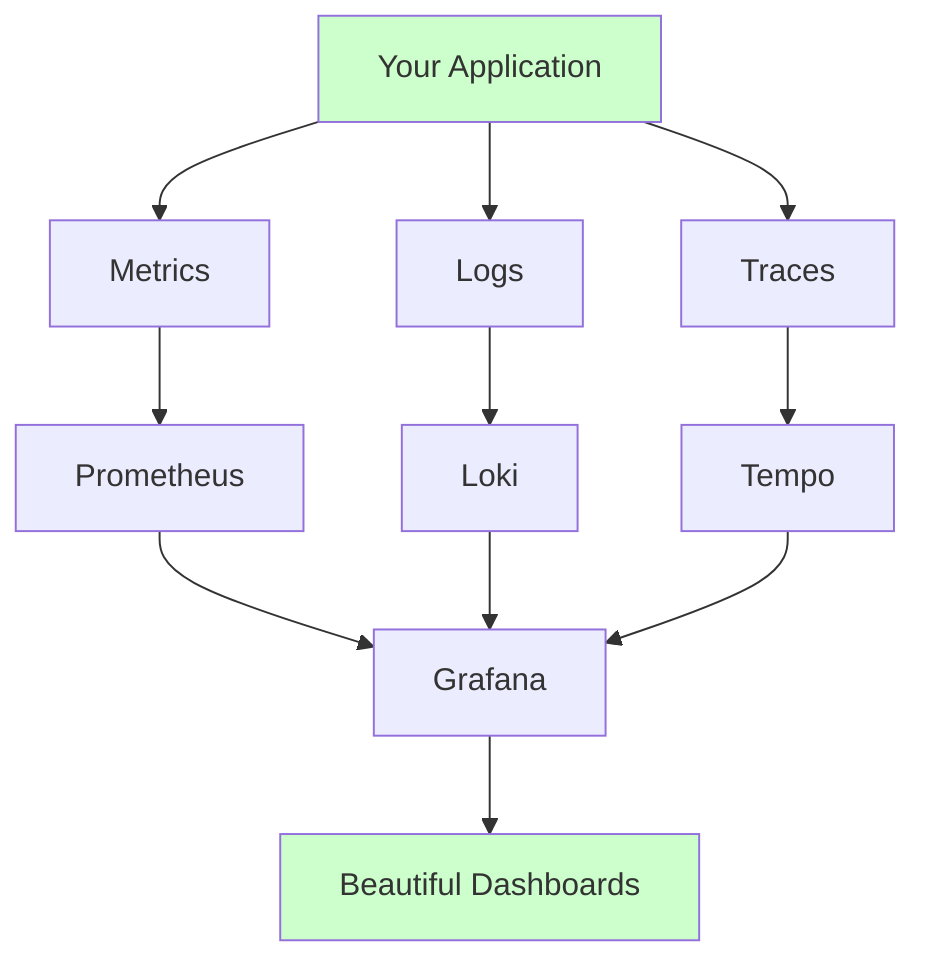
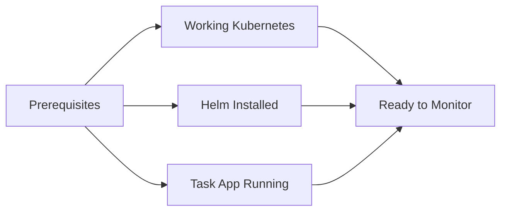
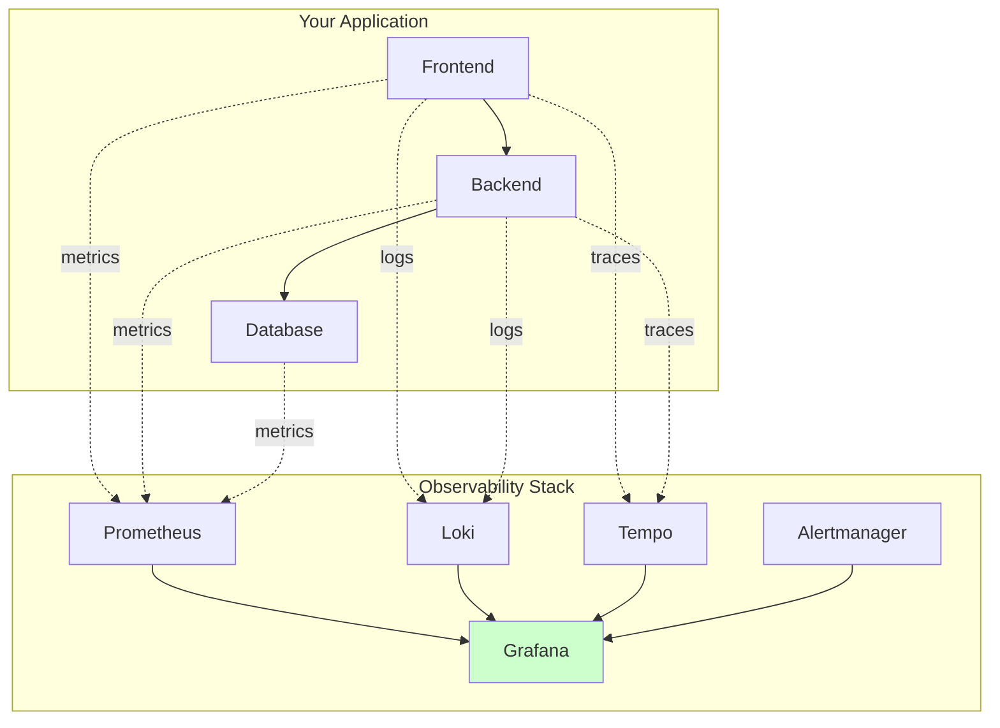

# Observability Stack Setup

This guide will help you implement comprehensive monitoring, logging, and tracing for your task management application using the PGLT stack (Prometheus, Grafana, Loki, Tempo).

## What is Observability?

Observability helps you understand what's happening inside your application:



The three pillars of observability:
1. **Metrics**: Numbers that tell you how your app is performing
2. **Logs**: Text messages that tell you what happened
3. **Traces**: Show you how requests flow through your system

## Before We Start

You'll need:


1. Working Kubernetes cluster (from guide 01)
2. Helm installed (from guide 02)
3. Task management app deployed (from guide 05)
4. Basic understanding of your application

## What We'll Build

Here's our complete observability stack:



## Step 1: Install the Grafana Stack

### 1. Add Grafana Helm Repository

```bash
# Add the official Grafana Helm repository
helm repo add grafana https://grafana.github.io/helm-charts
helm repo update

# Verify the repository
helm search repo grafana
```

### 2. Create Observability Namespace

```bash
# Create dedicated namespace for monitoring
kubectl create namespace observability

# Verify namespace
kubectl get namespaces
```

### 3. Install Prometheus Stack

```bash
# Install kube-prometheus-stack (includes Prometheus, Grafana, Alertmanager)
helm install prometheus grafana/kube-prometheus-stack \
  --namespace observability \
  --set grafana.adminPassword=admin123 \
  --set prometheus.prometheusSpec.retention=7d

# Check installation
kubectl get pods -n observability
```

This installs:
- Prometheus (metrics collection)
- Grafana (visualization)
- Alertmanager (alerting)
- Node Exporter (system metrics)
- Kube State Metrics (Kubernetes metrics)

## Step 2: Install Loki for Logging

```bash
# Install Loki stack
helm install loki grafana/loki-stack \
  --namespace observability \
  --set grafana.enabled=false \
  --set prometheus.enabled=false \
  --set promtail.enabled=true

# Verify Loki installation
kubectl get pods -n observability -l app=loki
```

## Step 3: Install Tempo for Tracing

```bash
# Install Tempo
helm install tempo grafana/tempo \
  --namespace observability \
  --set tempo.retention=24h

# Verify Tempo installation
kubectl get pods -n observability -l app.kubernetes.io/name=tempo
```

## Step 4: Access Grafana

### 1. Port Forward to Grafana

```bash
# Forward Grafana port
kubectl port-forward svc/prometheus-grafana 3000:80 -n observability
```

### 2. Login to Grafana

1. Open http://localhost:3000
2. Login with:
   - Username: `admin`
   - Password: `admin123`

### 3. Verify Data Sources

Grafana should automatically have these data sources configured:
- Prometheus (metrics)
- Loki (logs) - you may need to add this manually
- Tempo (traces) - you may need to add this manually

## Step 5: Configure Your Application

### 1. Add Metrics to Backend

Edit your backend application to expose metrics:

```javascript
// Add to your backend package.json
"dependencies": {
  "prom-client": "^14.0.0"
}

// Add to your backend server.js
const client = require('prom-client');

// Create metrics
const httpRequestDuration = new client.Histogram({
  name: 'http_request_duration_seconds',
  help: 'Duration of HTTP requests in seconds',
  labelNames: ['method', 'route', 'status']
});

// Expose metrics endpoint
app.get('/metrics', async (req, res) => {
  res.set('Content-Type', client.register.contentType);
  res.end(await client.register.metrics());
});
```

### 2. Configure Log Collection

Promtail (installed with Loki) automatically collects logs from all pods.

### 3. Add Tracing (Optional)

For distributed tracing, you can add OpenTelemetry to your application.

## Testing Your Setup

### 1. Check All Components

```bash
# Check all observability pods
kubectl get pods -n observability

# Check services
kubectl get svc -n observability
```

### 2. Generate Some Data

```bash
# Generate traffic to your application
kubectl port-forward svc/frontend 8080:3000 -n task-app

# In another terminal, generate requests
for i in {1..100}; do
  curl http://localhost:8080
  sleep 1
done
```

### 3. View in Grafana

1. Go to Grafana (http://localhost:3000)
2. Explore → Metrics → Try some queries:
   - `up` (shows which services are running)
   - `rate(http_requests_total[5m])` (request rate)
3. Explore → Logs → View application logs
4. Create your first dashboard!

## Next Steps

1. [Configure Dashboards](./07-grafana-dashboards.md)
2. [Set Up Alerting](./08-alerting-setup.md)
3. [Application Instrumentation](./09-app-instrumentation.md)

## Troubleshooting

### Prometheus Not Scraping Metrics

```bash
# Check Prometheus targets
kubectl port-forward svc/prometheus-kube-prometheus-prometheus 9090:9090 -n observability
# Visit http://localhost:9090/targets
```

### Grafana Data Source Issues

```bash
# Check Grafana logs
kubectl logs deployment/prometheus-grafana -n observability
```

### Loki Not Receiving Logs

```bash
# Check Promtail logs
kubectl logs daemonset/loki-promtail -n observability
```

## Quick Commands

```bash
# View all observability resources
kubectl get all -n observability

# Check resource usage
kubectl top pods -n observability

# Restart a component
kubectl rollout restart deployment/prometheus-grafana -n observability
```

Remember:
- Start with basic metrics
- Add complexity gradually
- Monitor your monitoring stack too!
- Keep dashboards simple and focused
