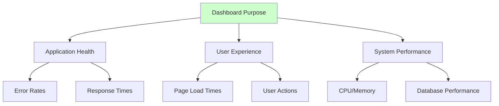
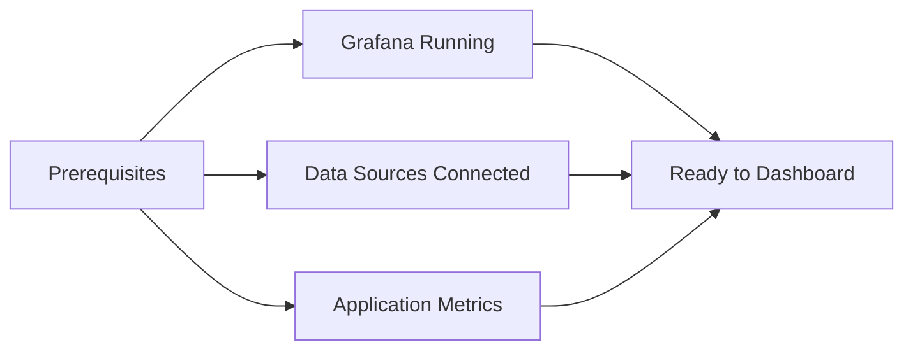
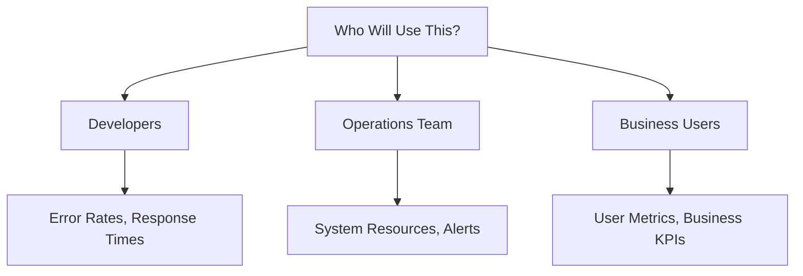
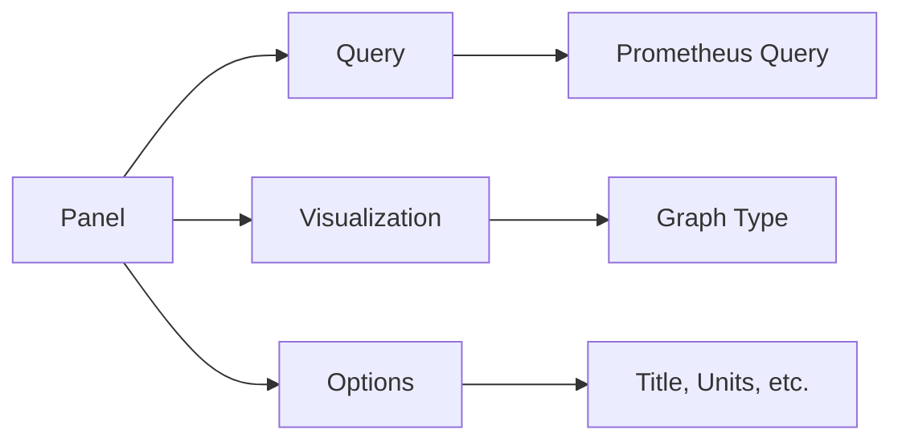
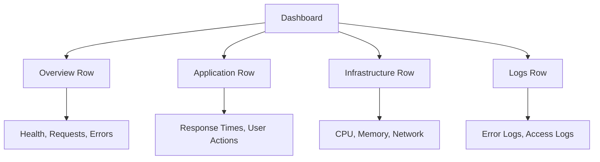
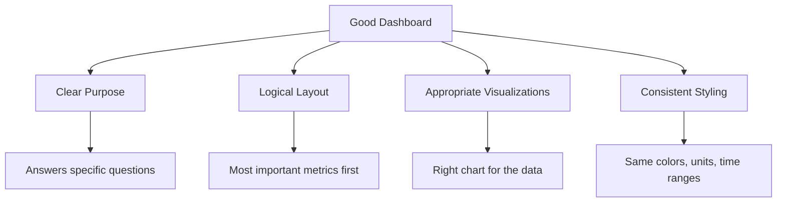

# Creating Grafana Dashboards

This guide will help you create beautiful and useful dashboards for monitoring your task management application.

## What Makes a Good Dashboard?

A good dashboard tells a story about your application:



## Before We Start

You'll need:


1. Grafana accessible (from previous guide)
2. Prometheus collecting metrics
3. Loki collecting logs
4. Your application running and generating data

## Dashboard Planning

### 1. Identify Your Audience



### 2. Choose Your Metrics

For our task management app, we'll track:

**Application Metrics:**
- HTTP request rate
- Response times
- Error rates
- Active users

**Infrastructure Metrics:**
- CPU usage
- Memory usage
- Pod restarts
- Network traffic

**Business Metrics:**
- Tasks created
- Tasks completed
- User activity

## Creating Your First Dashboard

### 1. Access Grafana

```bash
# Make sure Grafana is accessible
kubectl port-forward svc/prometheus-grafana 3000:80 -n observability
```

Visit http://localhost:3000 and login with admin/admin123

### 2. Create New Dashboard

1. Click the "+" icon in the left sidebar
2. Select "Dashboard"
3. Click "Add new panel"

### 3. Basic Panel Configuration



## Essential Panels for Your App

### 1. Application Health Panel

**Panel Title:** "Application Health Overview"
**Visualization:** Stat
**Query:**
```promql
# Number of healthy pods
up{job="task-app"}
```

**Configuration:**
- Unit: Short
- Color: Green for 1, Red for 0
- Thresholds: Red < 1, Green >= 1

### 2. Request Rate Panel

**Panel Title:** "HTTP Requests per Second"
**Visualization:** Time series
**Query:**
```promql
# Request rate over 5 minutes
rate(http_requests_total[5m])
```

### 3. Response Time Panel

**Panel Title:** "Average Response Time"
**Visualization:** Time series
**Query:**
```promql
# Average response time
rate(http_request_duration_seconds_sum[5m]) / rate(http_request_duration_seconds_count[5m])
```

### 4. Error Rate Panel

**Panel Title:** "Error Rate %"
**Visualization:** Stat
**Query:**
```promql
# Error rate percentage
(rate(http_requests_total{status=~"5.."}[5m]) / rate(http_requests_total[5m])) * 100
```

**Configuration:**
- Unit: Percent (0-100)
- Thresholds: Green < 1, Yellow < 5, Red >= 5

### 5. Resource Usage Panel

**Panel Title:** "Pod CPU Usage"
**Visualization:** Time series
**Query:**
```promql
# CPU usage by pod
rate(container_cpu_usage_seconds_total{pod=~"task-app.*"}[5m]) * 100
```

### 6. Memory Usage Panel

**Panel Title:** "Pod Memory Usage"
**Visualization:** Time series
**Query:**
```promql
# Memory usage by pod
container_memory_working_set_bytes{pod=~"task-app.*"} / 1024 / 1024
```

**Configuration:**
- Unit: Megabytes (MB)

## Creating a Logs Panel

### 1. Add Loki Data Source (if not already added)

1. Go to Configuration → Data Sources
2. Click "Add data source"
3. Select "Loki"
4. URL: `http://loki:3100`
5. Click "Save & Test"

### 2. Create Log Panel

**Panel Title:** "Application Logs"
**Visualization:** Logs
**Query:**
```logql
# Recent logs from your application
{namespace="task-app"} |= "error" or "ERROR"
```

## Dashboard Organization

### 1. Row Organization



### 2. Panel Sizing

- **Full width**: Important metrics (error rates, health status)
- **Half width**: Related metrics (CPU and memory)
- **Quarter width**: Simple stats (uptime, version)

## Dashboard Variables

### 1. Create Environment Variable

1. Go to Dashboard Settings (gear icon)
2. Click "Variables"
3. Click "Add variable"

**Configuration:**
- Name: `environment`
- Type: `Query`
- Data source: `Prometheus`
- Query: `label_values(up, environment)`

### 2. Use Variables in Queries

```promql
# Use the environment variable
up{environment="$environment"}
```

## Alerting Integration

### 1. Add Alert to Panel

1. Edit a panel
2. Go to "Alert" tab
3. Click "Create Alert"

**Example Alert:**
- Condition: `avg() OF query(A, 5m, now) IS ABOVE 5`
- Evaluation: Every `10s` for `30s`
- Message: "High error rate detected"

## Best Practices

### 1. Dashboard Design



### 2. Performance Tips

- Limit time ranges for heavy queries
- Use recording rules for complex calculations
- Avoid too many panels on one dashboard
- Use template variables to reduce query load

### 3. Naming Conventions

- **Dashboards**: "Service - Purpose" (e.g., "Task App - Overview")
- **Panels**: Clear, descriptive titles
- **Variables**: Lowercase with underscores

## Importing Pre-built Dashboards

### 1. Kubernetes Cluster Monitoring

1. Go to "+" → Import
2. Enter ID: `3119` (Kubernetes cluster monitoring)
3. Select Prometheus data source
4. Click "Import"

### 2. Node Exporter Dashboard

1. Import ID: `1860` (Node Exporter Full)
2. Great for system-level monitoring

## Sharing Dashboards

### 1. Export Dashboard

1. Dashboard Settings → JSON Model
2. Copy the JSON
3. Save to your Git repository

### 2. Import Dashboard

1. "+" → Import
2. Paste JSON or upload file
3. Configure data sources

## Testing Your Dashboard

### 1. Generate Load

```bash
# Generate traffic to test your metrics
kubectl port-forward svc/frontend 8080:3000 -n task-app

# In another terminal
for i in {1..1000}; do
  curl http://localhost:8080
  sleep 0.1
done
```

### 2. Verify Metrics

1. Check that panels update with new data
2. Verify alerts trigger when thresholds are crossed
3. Test different time ranges

## Next Steps

1. [Set Up Alerting](./08-alerting-setup.md)
2. [Application Instrumentation](./09-app-instrumentation.md)
3. [Advanced Monitoring](./10-advanced-monitoring.md)

## Troubleshooting

### No Data in Panels

```bash
# Check if Prometheus is scraping your app
kubectl port-forward svc/prometheus-kube-prometheus-prometheus 9090:9090 -n observability
# Visit http://localhost:9090/targets
```

### Slow Dashboard Loading

- Reduce time range
- Simplify queries
- Use recording rules for complex calculations

### Missing Metrics

- Verify your application exposes metrics
- Check Prometheus configuration
- Ensure proper labels are used

Remember:
- Start simple, add complexity gradually
- Focus on actionable metrics
- Test your dashboards regularly
- Keep your audience in mind!
