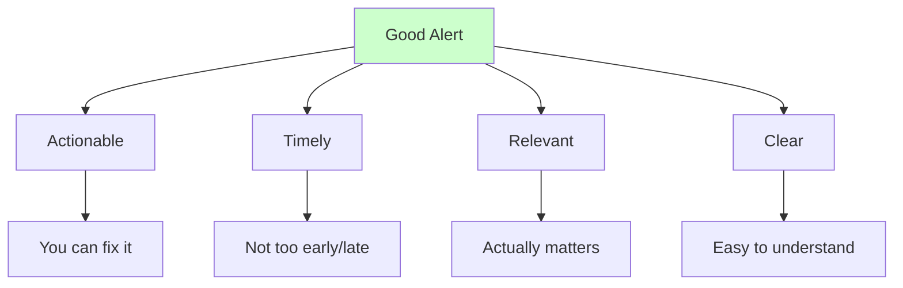
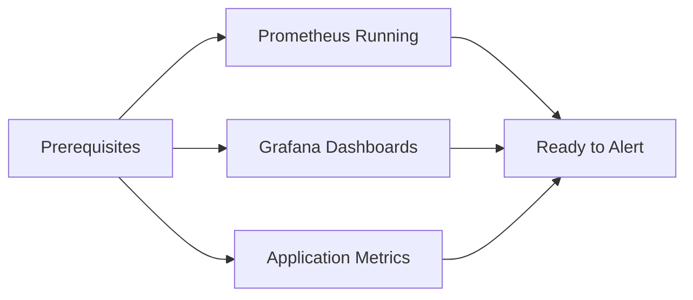
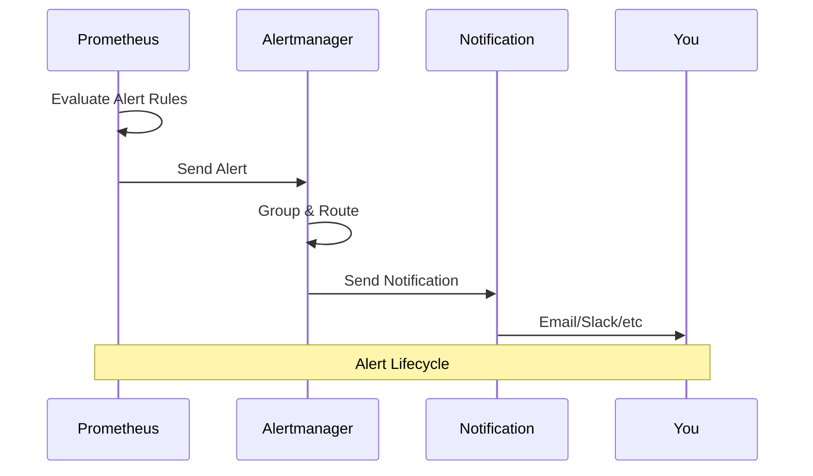
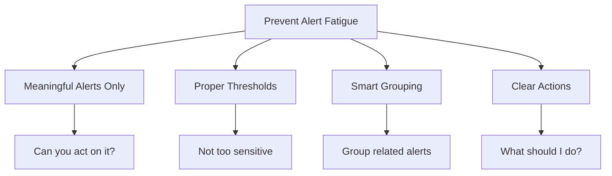

# Setting Up Alerting

This guide will help you set up intelligent alerting for your task management application so you know when something goes wrong before your users do!

## What Makes Good Alerting?

Good alerts are like a good friend - they tell you what you need to know, when you need to know it:



## Before We Start

You'll need:


1. Prometheus and Grafana running (from guide 06)
2. Application metrics being collected
3. Basic understanding of your application's normal behavior

## Understanding the Alerting Flow



## Step 1: Configure Alertmanager

Alertmanager is already installed with the Prometheus stack, but we need to configure it.

### 1. Create Alertmanager Configuration

```bash
# Create alertmanager config
cat > alertmanager-config.yaml << EOF
apiVersion: v1
kind: Secret
metadata:
  name: alertmanager-prometheus-kube-prometheus-alertmanager
  namespace: observability
type: Opaque
stringData:
  alertmanager.yml: |
    global:
      smtp_smarthost: 'localhost:587'
      smtp_from: 'alerts@yourcompany.com'
    
    route:
      group_by: ['alertname']
      group_wait: 10s
      group_interval: 10s
      repeat_interval: 1h
      receiver: 'web.hook'
    
    receivers:
    - name: 'web.hook'
      webhook_configs:
      - url: 'http://localhost:5001/'
        send_resolved: true
    
    # For Slack notifications (optional)
    # - name: 'slack-notifications'
    #   slack_configs:
    #   - api_url: 'YOUR_SLACK_WEBHOOK_URL'
    #     channel: '#alerts'
    #     title: 'Alert: {{ .GroupLabels.alertname }}'
    #     text: '{{ range .Alerts }}{{ .Annotations.summary }}{{ end }}'
EOF

# Apply the configuration
kubectl apply -f alertmanager-config.yaml
```

### 2. Restart Alertmanager

```bash
# Restart to pick up new config
kubectl rollout restart statefulset/alertmanager-prometheus-kube-prometheus-alertmanager -n observability
```

## Step 2: Create Alert Rules

### 1. Basic Application Alerts

```bash
# Create alert rules for your application
cat > app-alerts.yaml << EOF
apiVersion: monitoring.coreos.com/v1
kind: PrometheusRule
metadata:
  name: task-app-alerts
  namespace: observability
  labels:
    prometheus: kube-prometheus-stack-prometheus
    role: alert-rules
spec:
  groups:
  - name: task-app.rules
    rules:
    
    # High Error Rate Alert
    - alert: HighErrorRate
      expr: |
        (
          rate(http_requests_total{status=~"5.."}[5m]) / 
          rate(http_requests_total[5m])
        ) * 100 > 5
      for: 2m
      labels:
        severity: warning
        service: task-app
      annotations:
        summary: "High error rate detected"
        description: "Error rate is {{ \$value }}% for the last 5 minutes"
    
    # Application Down Alert
    - alert: ApplicationDown
      expr: up{job="task-app"} == 0
      for: 1m
      labels:
        severity: critical
        service: task-app
      annotations:
        summary: "Application is down"
        description: "Task application has been down for more than 1 minute"
    
    # High Response Time Alert
    - alert: HighResponseTime
      expr: |
        (
          rate(http_request_duration_seconds_sum[5m]) / 
          rate(http_request_duration_seconds_count[5m])
        ) > 1
      for: 5m
      labels:
        severity: warning
        service: task-app
      annotations:
        summary: "High response time detected"
        description: "Average response time is {{ \$value }}s for the last 5 minutes"
    
    # High Memory Usage Alert
    - alert: HighMemoryUsage
      expr: |
        (
          container_memory_working_set_bytes{pod=~"task-app.*"} / 
          container_spec_memory_limit_bytes{pod=~"task-app.*"}
        ) * 100 > 80
      for: 5m
      labels:
        severity: warning
        service: task-app
      annotations:
        summary: "High memory usage detected"
        description: "Memory usage is {{ \$value }}% for pod {{ \$labels.pod }}"
    
    # Pod Restart Alert
    - alert: PodRestarting
      expr: rate(kube_pod_container_status_restarts_total{pod=~"task-app.*"}[5m]) > 0
      for: 1m
      labels:
        severity: warning
        service: task-app
      annotations:
        summary: "Pod is restarting frequently"
        description: "Pod {{ \$labels.pod }} has restarted {{ \$value }} times in the last 5 minutes"

EOF

# Apply the alert rules
kubectl apply -f app-alerts.yaml
```

### 2. Infrastructure Alerts

```bash
# Create infrastructure alert rules
cat > infra-alerts.yaml << EOF
apiVersion: monitoring.coreos.com/v1
kind: PrometheusRule
metadata:
  name: infrastructure-alerts
  namespace: observability
  labels:
    prometheus: kube-prometheus-stack-prometheus
    role: alert-rules
spec:
  groups:
  - name: infrastructure.rules
    rules:
    
    # Node CPU Usage Alert
    - alert: HighNodeCPU
      expr: (100 - (avg by (instance) (rate(node_cpu_seconds_total{mode="idle"}[5m])) * 100)) > 80
      for: 5m
      labels:
        severity: warning
      annotations:
        summary: "High CPU usage on node"
        description: "CPU usage is {{ \$value }}% on node {{ \$labels.instance }}"
    
    # Node Memory Usage Alert
    - alert: HighNodeMemory
      expr: (1 - (node_memory_MemAvailable_bytes / node_memory_MemTotal_bytes)) * 100 > 80
      for: 5m
      labels:
        severity: warning
      annotations:
        summary: "High memory usage on node"
        description: "Memory usage is {{ \$value }}% on node {{ \$labels.instance }}"
    
    # Disk Space Alert
    - alert: LowDiskSpace
      expr: (1 - (node_filesystem_avail_bytes / node_filesystem_size_bytes)) * 100 > 80
      for: 5m
      labels:
        severity: warning
      annotations:
        summary: "Low disk space"
        description: "Disk usage is {{ \$value }}% on {{ \$labels.instance }}:{{ \$labels.mountpoint }}"

EOF

# Apply infrastructure alerts
kubectl apply -f infra-alerts.yaml
```

## Step 3: Test Your Alerts

### 1. Check Alert Rules

```bash
# Port forward to Prometheus
kubectl port-forward svc/prometheus-kube-prometheus-prometheus 9090:9090 -n observability
```

Visit http://localhost:9090/alerts to see your alert rules.

### 2. Trigger a Test Alert

```bash
# Scale down your application to trigger "ApplicationDown" alert
kubectl scale deployment/frontend --replicas=0 -n task-app

# Wait 2-3 minutes, then check alerts in Prometheus
# Scale back up
kubectl scale deployment/frontend --replicas=1 -n task-app
```

### 3. Generate High Load

```bash
# Generate high load to trigger response time alerts
kubectl port-forward svc/frontend 8080:3000 -n task-app

# In another terminal, generate heavy load
for i in {1..10}; do
  (
    for j in {1..100}; do
      curl http://localhost:8080 &
    done
    wait
  ) &
done
```

## Step 4: Set Up Notification Channels

### 1. Slack Integration (Optional)

If you want Slack notifications:

1. Create a Slack webhook URL
2. Update the alertmanager configuration:

```yaml
receivers:
- name: 'slack-notifications'
  slack_configs:
  - api_url: 'YOUR_SLACK_WEBHOOK_URL'
    channel: '#alerts'
    title: 'Alert: {{ .GroupLabels.alertname }}'
    text: |
      {{ range .Alerts }}
      *Alert:* {{ .Annotations.summary }}
      *Description:* {{ .Annotations.description }}
      *Severity:* {{ .Labels.severity }}
      {{ end }}
```

### 2. Email Notifications

For email notifications, configure SMTP in alertmanager:

```yaml
global:
  smtp_smarthost: 'smtp.gmail.com:587'
  smtp_from: 'your-email@gmail.com'
  smtp_auth_username: 'your-email@gmail.com'
  smtp_auth_password: 'your-app-password'

receivers:
- name: 'email-notifications'
  email_configs:
  - to: 'team@yourcompany.com'
    subject: 'Alert: {{ .GroupLabels.alertname }}'
    body: |
      {{ range .Alerts }}
      Alert: {{ .Annotations.summary }}
      Description: {{ .Annotations.description }}
      Severity: {{ .Labels.severity }}
      {{ end }}
```

## Step 5: Create Grafana Alerts

### 1. Create Alert in Grafana

1. Go to your dashboard
2. Edit a panel (e.g., Error Rate)
3. Go to "Alert" tab
4. Click "Create Alert"

**Configuration:**
- **Query**: Your metric query
- **Condition**: `IS ABOVE 5` (for 5% error rate)
- **Evaluation**: Every `10s` for `30s`
- **Message**: "High error rate detected in task application"

### 2. Create Notification Channel

1. Go to Alerting → Notification channels
2. Click "Add channel"
3. Choose type (Email, Slack, Webhook, etc.)
4. Configure settings
5. Test the channel

## Alert Best Practices

### 1. Alert Fatigue Prevention



### 2. Alert Severity Levels

- **Critical**: Immediate action required (app down, data loss)
- **Warning**: Attention needed soon (high error rate, resource usage)
- **Info**: Good to know (deployments, maintenance)

### 3. Alert Naming

- Use clear, descriptive names
- Include the service/component
- Indicate severity in the name

## Monitoring Your Monitoring

### 1. Alertmanager Health

```promql
# Check if Alertmanager is running
up{job="alertmanager"}

# Check alert processing rate
rate(alertmanager_alerts_received_total[5m])
```

### 2. Prometheus Health

```promql
# Check Prometheus targets
up

# Check rule evaluation time
prometheus_rule_evaluation_duration_seconds
```

## Troubleshooting

### Alerts Not Firing

```bash
# Check Prometheus rules
kubectl get prometheusrules -n observability

# Check Prometheus logs
kubectl logs deployment/prometheus-kube-prometheus-prometheus -n observability
```

### Notifications Not Sent

```bash
# Check Alertmanager logs
kubectl logs statefulset/alertmanager-prometheus-kube-prometheus-alertmanager -n observability

# Check Alertmanager config
kubectl get secret alertmanager-prometheus-kube-prometheus-alertmanager -n observability -o yaml
```

### False Positives

- Adjust thresholds based on normal behavior
- Increase evaluation time (`for: 5m`)
- Add more specific conditions

## Next Steps

1. [Application Instrumentation](./09-app-instrumentation.md)
2. [Advanced Monitoring](./10-advanced-monitoring.md)
3. [Runbook Creation](./11-runbooks.md)

Remember:
- Start with critical alerts only
- Test your alerts regularly
- Document what each alert means
- Keep alert messages actionable!
