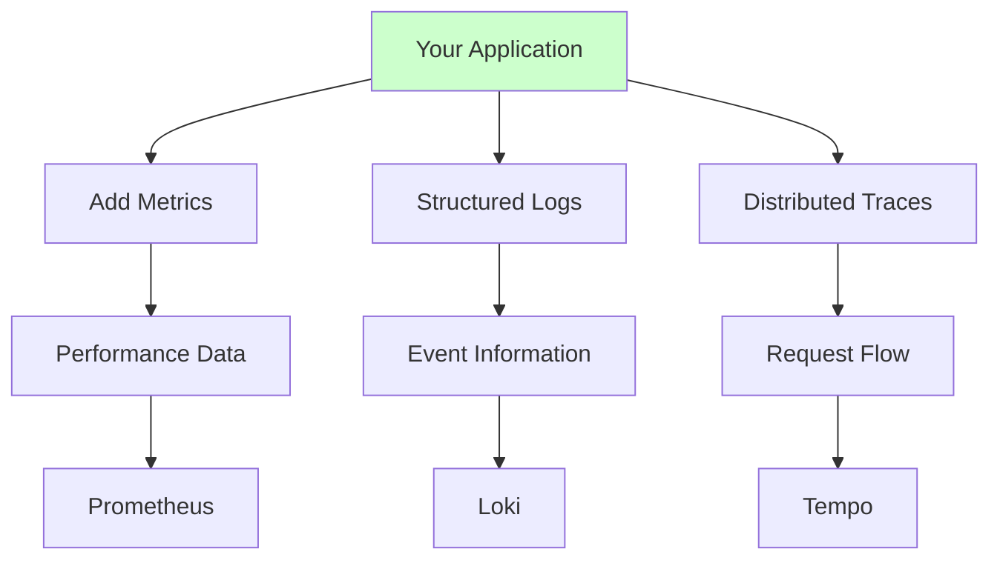
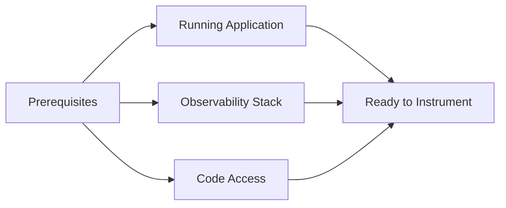
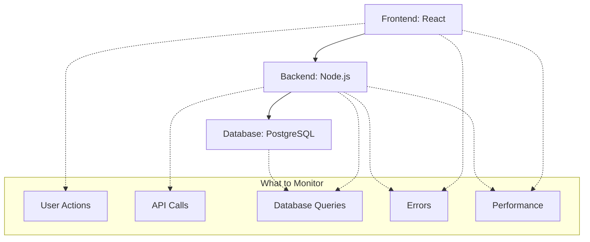

# Application Instrumentation

This guide will help you add comprehensive monitoring to your task management application by instrumenting your code with metrics, logs, and traces.

## What is Application Instrumentation?

Instrumentation is like adding sensors to your application:



## Before We Start

You'll need:


1. Task management application running
2. Prometheus, Grafana, Loki, Tempo deployed
3. Access to modify application code
4. Basic understanding of your application architecture

## Understanding the Application

Let's review what we're instrumenting:



## Step 1: Backend Instrumentation (Node.js)

### 1. Add Monitoring Dependencies

```bash
# Navigate to your backend directory
cd app/backend

# Add monitoring packages
npm install prom-client winston express-winston opentelemetry-api @opentelemetry/auto-instrumentations-node
```

### 2. Create Metrics Module

Create `src/monitoring/metrics.js`:

```javascript
const client = require('prom-client');

// Create a Registry
const register = new client.Registry();

// Add default metrics
client.collectDefaultMetrics({ register });

// Custom metrics for our application
const httpRequestDuration = new client.Histogram({
  name: 'http_request_duration_seconds',
  help: 'Duration of HTTP requests in seconds',
  labelNames: ['method', 'route', 'status_code'],
  buckets: [0.1, 0.3, 0.5, 0.7, 1, 3, 5, 7, 10]
});

const httpRequestsTotal = new client.Counter({
  name: 'http_requests_total',
  help: 'Total number of HTTP requests',
  labelNames: ['method', 'route', 'status_code']
});

const tasksTotal = new client.Counter({
  name: 'tasks_total',
  help: 'Total number of tasks created',
  labelNames: ['status']
});

const activeUsers = new client.Gauge({
  name: 'active_users_total',
  help: 'Number of active users'
});

const databaseConnectionsActive = new client.Gauge({
  name: 'database_connections_active',
  help: 'Number of active database connections'
});

// Register metrics
register.registerMetric(httpRequestDuration);
register.registerMetric(httpRequestsTotal);
register.registerMetric(tasksTotal);
register.registerMetric(activeUsers);
register.registerMetric(databaseConnectionsActive);

module.exports = {
  register,
  httpRequestDuration,
  httpRequestsTotal,
  tasksTotal,
  activeUsers,
  databaseConnectionsActive
};
```

### 3. Add Metrics Middleware

Create `src/middleware/metrics.js`:

```javascript
const { httpRequestDuration, httpRequestsTotal } = require('../monitoring/metrics');

const metricsMiddleware = (req, res, next) => {
  const start = Date.now();
  
  res.on('finish', () => {
    const duration = (Date.now() - start) / 1000;
    const route = req.route ? req.route.path : req.path;
    
    // Record metrics
    httpRequestDuration
      .labels(req.method, route, res.statusCode)
      .observe(duration);
    
    httpRequestsTotal
      .labels(req.method, route, res.statusCode)
      .inc();
  });
  
  next();
};

module.exports = metricsMiddleware;
```

### 4. Update Server Configuration

Update `src/server.js`:

```javascript
const express = require('express');
const cors = require('cors');
const { register } = require('./monitoring/metrics');
const metricsMiddleware = require('./middleware/metrics');
const winston = require('winston');

const app = express();

// Configure logging
const logger = winston.createLogger({
  level: 'info',
  format: winston.format.combine(
    winston.format.timestamp(),
    winston.format.errors({ stack: true }),
    winston.format.json()
  ),
  transports: [
    new winston.transports.Console(),
    new winston.transports.File({ filename: 'app.log' })
  ]
});

// Middleware
app.use(cors());
app.use(express.json());
app.use(metricsMiddleware);

// Health check endpoint
app.get('/health', (req, res) => {
  logger.info('Health check requested');
  res.status(200).json({ 
    status: 'healthy', 
    timestamp: new Date().toISOString(),
    uptime: process.uptime()
  });
});

// Metrics endpoint for Prometheus
app.get('/metrics', async (req, res) => {
  res.set('Content-Type', register.contentType);
  res.end(await register.metrics());
});

// Your existing routes...
app.use('/api/tasks', require('./routes/tasks'));

// Error handling middleware
app.use((err, req, res, next) => {
  logger.error('Unhandled error', {
    error: err.message,
    stack: err.stack,
    url: req.url,
    method: req.method
  });
  
  res.status(500).json({ error: 'Internal server error' });
});

const PORT = process.env.PORT || 3000;
app.listen(PORT, () => {
  logger.info(`Server running on port ${PORT}`);
});
```

### 5. Instrument Task Operations

Update `src/routes/tasks.js`:

```javascript
const express = require('express');
const router = express.Router();
const { tasksTotal } = require('../monitoring/metrics');
const winston = require('winston');

const logger = winston.createLogger({
  level: 'info',
  format: winston.format.json(),
  transports: [new winston.transports.Console()]
});

// Get all tasks
router.get('/', async (req, res) => {
  try {
    logger.info('Fetching all tasks', { userId: req.user?.id });
    
    // Your existing database query...
    const tasks = await getTasks();
    
    logger.info('Tasks fetched successfully', { 
      count: tasks.length,
      userId: req.user?.id 
    });
    
    res.json(tasks);
  } catch (error) {
    logger.error('Error fetching tasks', { 
      error: error.message,
      userId: req.user?.id 
    });
    res.status(500).json({ error: 'Failed to fetch tasks' });
  }
});

// Create new task
router.post('/', async (req, res) => {
  try {
    logger.info('Creating new task', { 
      title: req.body.title,
      userId: req.user?.id 
    });
    
    // Your existing task creation logic...
    const task = await createTask(req.body);
    
    // Increment task counter
    tasksTotal.labels('created').inc();
    
    logger.info('Task created successfully', { 
      taskId: task.id,
      title: task.title,
      userId: req.user?.id 
    });
    
    res.status(201).json(task);
  } catch (error) {
    logger.error('Error creating task', { 
      error: error.message,
      body: req.body,
      userId: req.user?.id 
    });
    res.status(500).json({ error: 'Failed to create task' });
  }
});

// Update task status
router.put('/:id', async (req, res) => {
  try {
    const taskId = req.params.id;
    logger.info('Updating task', { taskId, updates: req.body });
    
    // Your existing update logic...
    const task = await updateTask(taskId, req.body);
    
    // Track status changes
    if (req.body.status === 'completed') {
      tasksTotal.labels('completed').inc();
    }
    
    logger.info('Task updated successfully', { taskId, task });
    res.json(task);
  } catch (error) {
    logger.error('Error updating task', { 
      taskId: req.params.id,
      error: error.message 
    });
    res.status(500).json({ error: 'Failed to update task' });
  }
});

module.exports = router;
```

## Step 2: Frontend Instrumentation (React)

### 1. Add Frontend Monitoring

```bash
# Navigate to frontend directory
cd app/frontend

# Add monitoring packages
npm install @prometheus-client/browser web-vitals
```

### 2. Create Frontend Metrics

Create `src/monitoring/metrics.js`:

```javascript
// Simple client-side metrics collection
class MetricsCollector {
  constructor() {
    this.metrics = [];
    this.apiUrl = process.env.REACT_APP_API_URL || 'http://localhost:3001';
  }

  // Track page views
  trackPageView(page) {
    this.addMetric('page_view', { page, timestamp: Date.now() });
    console.log(`Page view: ${page}`);
  }

  // Track user actions
  trackUserAction(action, details = {}) {
    this.addMetric('user_action', { 
      action, 
      ...details, 
      timestamp: Date.now() 
    });
    console.log(`User action: ${action}`, details);
  }

  // Track API calls
  trackApiCall(endpoint, method, duration, status) {
    this.addMetric('api_call', {
      endpoint,
      method,
      duration,
      status,
      timestamp: Date.now()
    });
  }

  // Track errors
  trackError(error, context = {}) {
    this.addMetric('error', {
      message: error.message,
      stack: error.stack,
      ...context,
      timestamp: Date.now()
    });
    console.error('Tracked error:', error, context);
  }

  addMetric(type, data) {
    this.metrics.push({ type, data });
    
    // Send to backend periodically (simple implementation)
    if (this.metrics.length >= 10) {
      this.flush();
    }
  }

  async flush() {
    if (this.metrics.length === 0) return;
    
    try {
      await fetch(`${this.apiUrl}/api/metrics/client`, {
        method: 'POST',
        headers: { 'Content-Type': 'application/json' },
        body: JSON.stringify({ metrics: this.metrics })
      });
      this.metrics = [];
    } catch (error) {
      console.error('Failed to send metrics:', error);
    }
  }
}

export const metricsCollector = new MetricsCollector();

// Track Web Vitals
import { getCLS, getFID, getFCP, getLCP, getTTFB } from 'web-vitals';

function sendToAnalytics(metric) {
  metricsCollector.addMetric('web_vital', {
    name: metric.name,
    value: metric.value,
    id: metric.id
  });
}

getCLS(sendToAnalytics);
getFID(sendToAnalytics);
getFCP(sendToAnalytics);
getLCP(sendToAnalytics);
getTTFB(sendToAnalytics);
```

### 3. Instrument React Components

Update `src/App.js`:

```javascript
import React, { useEffect } from 'react';
import { metricsCollector } from './monitoring/metrics';
import TaskList from './components/TaskList';

function App() {
  useEffect(() => {
    // Track app initialization
    metricsCollector.trackPageView('app');
    
    // Track errors globally
    window.addEventListener('error', (event) => {
      metricsCollector.trackError(event.error, {
        filename: event.filename,
        lineno: event.lineno,
        colno: event.colno
      });
    });

    // Track unhandled promise rejections
    window.addEventListener('unhandledrejection', (event) => {
      metricsCollector.trackError(new Error(event.reason), {
        type: 'unhandled_promise_rejection'
      });
    });
  }, []);

  return (
    <div className="App">
      <header className="App-header">
        <h1>Task Manager</h1>
      </header>
      <main>
        <TaskList />
      </main>
    </div>
  );
}

export default App;
```

### 4. Instrument API Calls

Create `src/utils/api.js`:

```javascript
import { metricsCollector } from '../monitoring/metrics';

const API_BASE = process.env.REACT_APP_API_URL || 'http://localhost:3001/api';

class ApiClient {
  async request(endpoint, options = {}) {
    const start = Date.now();
    const url = `${API_BASE}${endpoint}`;
    
    try {
      const response = await fetch(url, {
        headers: {
          'Content-Type': 'application/json',
          ...options.headers
        },
        ...options
      });
      
      const duration = Date.now() - start;
      
      // Track API call metrics
      metricsCollector.trackApiCall(
        endpoint,
        options.method || 'GET',
        duration,
        response.status
      );
      
      if (!response.ok) {
        throw new Error(`HTTP ${response.status}: ${response.statusText}`);
      }
      
      return await response.json();
    } catch (error) {
      const duration = Date.now() - start;
      
      // Track failed API call
      metricsCollector.trackApiCall(
        endpoint,
        options.method || 'GET',
        duration,
        'error'
      );
      
      metricsCollector.trackError(error, {
        endpoint,
        method: options.method || 'GET'
      });
      
      throw error;
    }
  }

  // Convenience methods
  get(endpoint) {
    return this.request(endpoint);
  }

  post(endpoint, data) {
    return this.request(endpoint, {
      method: 'POST',
      body: JSON.stringify(data)
    });
  }

  put(endpoint, data) {
    return this.request(endpoint, {
      method: 'PUT',
      body: JSON.stringify(data)
    });
  }

  delete(endpoint) {
    return this.request(endpoint, {
      method: 'DELETE'
    });
  }
}

export const apiClient = new ApiClient();
```

## Step 3: Configure Prometheus Scraping

### 1. Update Prometheus Configuration

Create `prometheus-config.yaml`:

```yaml
apiVersion: v1
kind: ConfigMap
metadata:
  name: prometheus-config
  namespace: observability
data:
  prometheus.yml: |
    global:
      scrape_interval: 15s
    
    scrape_configs:
    - job_name: 'task-app-backend'
      static_configs:
      - targets: ['backend.task-app.svc.cluster.local:3000']
      metrics_path: '/metrics'
      scrape_interval: 10s
    
    - job_name: 'task-app-frontend'
      static_configs:
      - targets: ['frontend.task-app.svc.cluster.local:3000']
      metrics_path: '/metrics'
      scrape_interval: 30s
```

### 2. Add Service Monitor

```yaml
apiVersion: monitoring.coreos.com/v1
kind: ServiceMonitor
metadata:
  name: task-app-monitor
  namespace: observability
spec:
  selector:
    matchLabels:
      app: task-app
  endpoints:
  - port: http
    path: /metrics
    interval: 15s
```

## Step 4: Test Your Instrumentation

### 1. Deploy Updated Application

```bash
# Build and deploy your updated application
docker build -t task-app-backend:instrumented ./app/backend
docker build -t task-app-frontend:instrumented ./app/frontend

# Update your Helm chart or Kubernetes manifests
kubectl rollout restart deployment/backend -n task-app
kubectl rollout restart deployment/frontend -n task-app
```

### 2. Verify Metrics Collection

```bash
# Check if metrics endpoint is working
kubectl port-forward svc/backend 3001:3000 -n task-app
curl http://localhost:3001/metrics

# Check Prometheus targets
kubectl port-forward svc/prometheus-kube-prometheus-prometheus 9090:9090 -n observability
# Visit http://localhost:9090/targets
```

### 3. Generate Test Data

```bash
# Generate some traffic to create metrics
kubectl port-forward svc/frontend 8080:3000 -n task-app

# Use the application:
# - Create tasks
# - Update task status
# - Delete tasks
# - Navigate between pages
```

## Next Steps

1. [Advanced Monitoring](./10-advanced-monitoring.md)
2. [Performance Optimization](./11-performance-monitoring.md)
3. [Distributed Tracing](./12-distributed-tracing.md)

## Troubleshooting

### Metrics Not Appearing

```bash
# Check if metrics endpoint is accessible
kubectl exec -it deployment/backend -n task-app -- curl localhost:3000/metrics

# Check Prometheus configuration
kubectl get configmap prometheus-config -n observability -o yaml
```

### High Cardinality Issues

- Avoid using user IDs or timestamps as labels
- Use bounded label values
- Consider using recording rules for complex calculations

### Performance Impact

- Monitor the overhead of instrumentation
- Use sampling for high-volume traces
- Consider async metric collection

Remember:
- Start with basic metrics
- Add instrumentation gradually
- Monitor the monitoring overhead
- Focus on actionable metrics!
