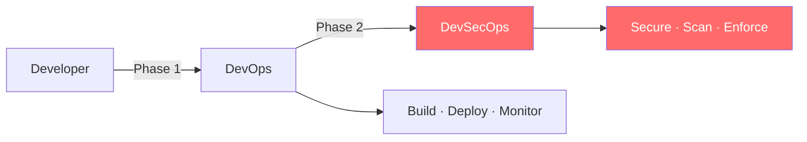
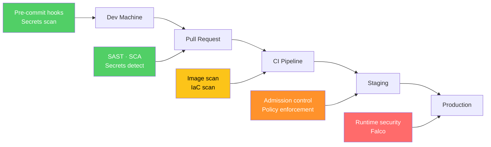
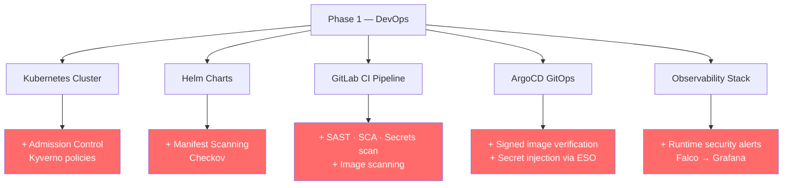

# Introduction to DevSecOps

Welcome to Phase 2 of your training! You've already built a solid DevOps foundation — containerization, Kubernetes, CI/CD, GitOps, and observability. Now we're going to secure it.

## What is DevSecOps?

DevSecOps means **security is everyone's responsibility, built into every stage of the pipeline** — not bolted on at the end.



In Phase 1, you focused on *how to ship*. In Phase 2, you focus on *how to ship safely*.

## Shift-Left Security

"Shift-left" means catching security problems **earlier in the pipeline**, when they're cheaper and easier to fix.



The earlier a vulnerability is found, the less damage it can cause.

## What You'll Implement in Phase 2

| # | Topic | What It Covers |
|---|---|---|
| 11 | SAST, SCA & Secrets Scanning | Semgrep, Trivy, Gitleaks in GitLab CI |
| 12 | Secrets Management | External Secrets Operator — no more hardcoded credentials |
| 13 | Manifest Security | Checkov scanning Helm charts and K8s manifests |
| 14 | Admission Control | Kyverno policies — enforce security at deploy time |
| 15 | Supply Chain Security | Syft (SBOM) + Cosign (image signing) |
| 16 | Runtime Security | Falco — detect threats in running containers |

## Security Controls: P0 vs P1

Think of security controls in two tiers:

**P0 — Non-negotiable (must implement)**
- Secrets never in code or environment variables
- Container images scanned before deployment
- K8s manifests checked for misconfigurations
- Signed images verified before running

**P1 — High value (strongly recommended)**
- SBOM generation for every build
- Runtime threat detection (Falco)
- Admission controllers blocking non-compliant workloads
- Dynamic application security testing (DAST)

In this training, you'll implement all P0 controls and most P1 controls.

## How This Phase Builds on Phase 1

You won't be starting from scratch. Everything you built in Phase 1 is the foundation:



## The Security Mindset

Before you write a single config, internalize these rules:

1. **Assume breach** — design as if attackers are already inside
2. **Least privilege** — every process gets only the permissions it needs, nothing more
3. **Defense in depth** — multiple layers of controls; no single point of failure
4. **Fail closed** — when in doubt, deny. Don't default to allow
5. **Everything is code** — security policies, scanning rules, and admission policies all live in Git

## Getting Started

Make sure your Phase 1 setup is working before continuing:

```bash
# Verify your cluster is running
kubectl get nodes

# Verify ArgoCD is running
kubectl get pods -n argocd

# Verify your GitLab CI pipeline is passing
# Check your GitLab project > CI/CD > Pipelines
```

Once everything is green, move on to [Guide 11 — SAST, SCA & Secrets Scanning](11-sast-sca-scanning.md).

## Remember

- Security is not a one-time task — it's continuous
- A failed security scan is **good news** — you caught it before production
- Start with the basics, add layers gradually
- Ask questions during lab sessions — security concepts can be unintuitive at first
