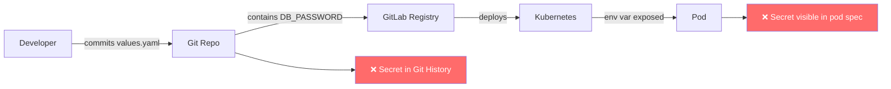
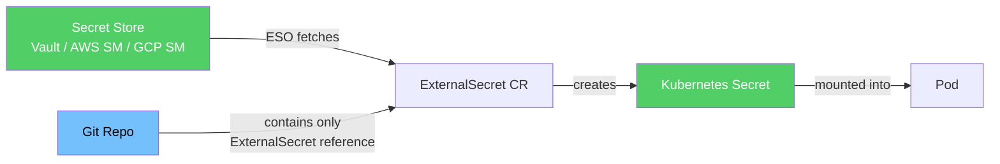

# Secrets Management with External Secrets Operator

One of the most common security mistakes in Kubernetes is storing credentials in `values.yaml`, `ConfigMaps`, or environment variables. In this guide you'll replace hardcoded secrets with a proper secrets management workflow using **External Secrets Operator (ESO)**.

## The Problem with Hardcoded Secrets



Even if you delete the secret from Git, it stays in the commit history. Anyone with repo access can find it with `git log`.

## The Right Way: External Secrets Operator



**ESO** reads secrets from an external store (HashiCorp Vault, AWS Secrets Manager, GCP Secret Manager, etc.) and creates native Kubernetes Secrets automatically. Your Git repo only contains a reference to where the secret lives — never the secret itself.

## What We'll Use in This Training

For local development we'll use **HashiCorp Vault** running inside your cluster. In production you would replace this with AWS Secrets Manager, GCP Secret Manager, or Azure Key Vault.

## Step 1: Install External Secrets Operator

```bash
# Add the ESO Helm repo
helm repo add external-secrets https://charts.external-secrets.io
helm repo update

# Install ESO into your cluster
helm install external-secrets \
  external-secrets/external-secrets \
  --namespace external-secrets \
  --create-namespace \
  --set installCRDs=true

# Verify it's running
kubectl get pods -n external-secrets
```

## Step 2: Install Vault (for local development)

```bash
# Add HashiCorp Helm repo
helm repo add hashicorp https://helm.releases.hashicorp.com
helm repo update

# Install Vault in dev mode (single node, in-memory — for local use only)
helm install vault hashicorp/vault \
  --namespace vault \
  --create-namespace \
  --set "server.dev.enabled=true"

# Wait for Vault to be ready
kubectl wait --for=condition=ready pod -l app.kubernetes.io/name=vault \
  -n vault --timeout=60s
```

## Step 3: Store Your App Secrets in Vault

```bash
# Open a shell into the Vault pod
kubectl exec -it vault-0 -n vault -- sh

# Enable the KV secrets engine
vault secrets enable -path=secret kv-v2

# Store your database credentials
vault kv put secret/three-tier-app/database \
  POSTGRES_PASSWORD="your-secure-password" \
  POSTGRES_USER="taskuser" \
  POSTGRES_DB="taskdb"

# Verify
vault kv get secret/three-tier-app/database

# Exit the pod
exit
```

## Step 4: Create a SecretStore

A `SecretStore` tells ESO how to connect to Vault:

```yaml
# secretstore.yaml
apiVersion: external-secrets.io/v1beta1
kind: SecretStore
metadata:
  name: vault-backend
  namespace: three-tier-app-dev
spec:
  provider:
    vault:
      server: "http://vault.vault.svc.cluster.local:8200"
      path: "secret"
      version: "v2"
      auth:
        tokenSecretRef:
          name: vault-token
          key: token
```

First, create the token secret ESO will use to authenticate with Vault:

```bash
# Get the Vault root token (dev mode only — never do this in production)
kubectl exec vault-0 -n vault -- vault token lookup

# Create the secret in your app namespace
kubectl create secret generic vault-token \
  --namespace three-tier-app-dev \
  --from-literal=token="root"   # dev mode token

# Apply the SecretStore
kubectl apply -f secretstore.yaml
```

## Step 5: Create an ExternalSecret

An `ExternalSecret` defines which keys to fetch from Vault and what Kubernetes Secret to create:

```yaml
# externalsecret-db.yaml
apiVersion: external-secrets.io/v1beta1
kind: ExternalSecret
metadata:
  name: database-credentials
  namespace: three-tier-app-dev
spec:
  refreshInterval: 1h           # How often ESO re-syncs the secret
  secretStoreRef:
    name: vault-backend
    kind: SecretStore
  target:
    name: database-secret       # Name of the K8s Secret to create
    creationPolicy: Owner
  data:
    - secretKey: POSTGRES_PASSWORD
      remoteRef:
        key: three-tier-app/database
        property: POSTGRES_PASSWORD
    - secretKey: POSTGRES_USER
      remoteRef:
        key: three-tier-app/database
        property: POSTGRES_USER
    - secretKey: POSTGRES_DB
      remoteRef:
        key: three-tier-app/database
        property: POSTGRES_DB
```

```bash
kubectl apply -f externalsecret-db.yaml

# ESO will create the Kubernetes Secret automatically
kubectl get secret database-secret -n three-tier-app-dev
```

## Step 6: Update Your Helm Chart to Use the Secret

In your Helm chart's `values.yaml`, **remove** hardcoded database credentials:

```yaml
# values.yaml — BEFORE (insecure)
database:
  password: "mysecretpassword"   # ❌ Never do this
  user: "postgres"
```

```yaml
# values.yaml — AFTER (secure)
database:
  existingSecret: "database-secret"   # ✅ Reference the secret ESO created
```

Update your backend deployment template to reference the secret:

```yaml
# templates/backend-deployment.yaml
env:
  - name: POSTGRES_PASSWORD
    valueFrom:
      secretKeyRef:
        name: {{ .Values.database.existingSecret }}
        key: POSTGRES_PASSWORD
  - name: POSTGRES_USER
    valueFrom:
      secretKeyRef:
        name: {{ .Values.database.existingSecret }}
        key: POSTGRES_USER
  - name: POSTGRES_DB
    valueFrom:
      secretKeyRef:
        name: {{ .Values.database.existingSecret }}
        key: POSTGRES_DB
```

## Verifying It Works

```bash
# Check ExternalSecret status — should show "SecretSynced"
kubectl describe externalsecret database-credentials -n three-tier-app-dev

# Check the secret was created
kubectl get secret database-secret -n three-tier-app-dev

# Verify secret values (base64 encoded)
kubectl get secret database-secret -n three-tier-app-dev -o jsonpath='{.data.POSTGRES_PASSWORD}' | base64 -d

# Check your backend pod is using the secret
kubectl describe pod -l app=backend -n three-tier-app-dev | grep -A3 "Environment"
```

## Secret Rotation

One major benefit of ESO is automatic secret rotation. When you update the secret in Vault, ESO refreshes the Kubernetes Secret on the next sync cycle (controlled by `refreshInterval`).

```bash
# Rotate the database password in Vault
kubectl exec -it vault-0 -n vault -- sh
vault kv put secret/three-tier-app/database \
  POSTGRES_PASSWORD="new-rotated-password" \
  POSTGRES_USER="taskuser" \
  POSTGRES_DB="taskdb"
exit

# ESO will automatically update the K8s Secret within refreshInterval
# Force immediate sync:
kubectl annotate externalsecret database-credentials \
  force-sync=$(date +%s) -n three-tier-app-dev
```

## What NOT to Do

```yaml
# ❌ NEVER store secrets as plain text in ConfigMaps
apiVersion: v1
kind: ConfigMap
data:
  DB_PASSWORD: "mysecretpassword"

# ❌ NEVER hardcode secrets in Helm values files
database:
  password: "mysecretpassword"

# ❌ NEVER store secrets in environment variables in your Dockerfile
ENV DB_PASSWORD=mysecretpassword

# ❌ NEVER commit .env files to Git
```

## Common Issues

### ExternalSecret stuck in "SecretSyncedError"
```bash
kubectl describe externalsecret database-credentials -n three-tier-app-dev
# Look at the "Events" section — usually a connection or auth issue with Vault
```

### Pod can't find the secret
```bash
# Make sure the secret is in the same namespace as the pod
kubectl get secrets -n three-tier-app-dev
```

### Vault token expired
```bash
# In dev mode the root token doesn't expire
# In production, use Kubernetes auth method instead of token auth
```

## Cheat Sheet

```bash
# Check ESO pods
kubectl get pods -n external-secrets

# Check all ExternalSecrets
kubectl get externalsecrets -A

# Check SecretStore status
kubectl describe secretstore vault-backend -n three-tier-app-dev

# Force ESO to re-sync a secret
kubectl annotate externalsecret <name> force-sync=$(date +%s) -n <namespace>

# Store a secret in Vault
kubectl exec -it vault-0 -n vault -- vault kv put secret/path key=value

# Read a secret from Vault
kubectl exec -it vault-0 -n vault -- vault kv get secret/path
```

## Next Steps

Your secrets are now managed externally and never touch Git. The next step is making sure your Kubernetes manifests and Helm charts don't have misconfigurations that could expose your workloads. Move on to [Guide 13 — Manifest Security with Checkov](13-manifest-security.md).
