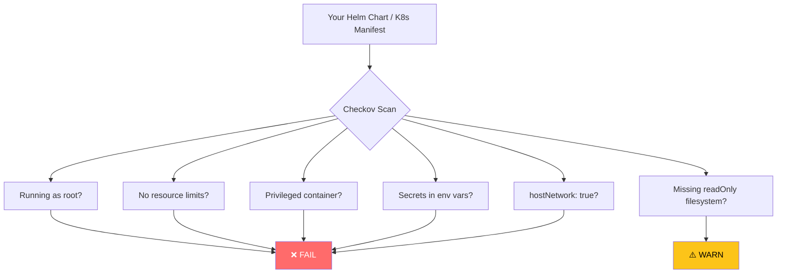

# Manifest Security with Checkov

Your Kubernetes manifests and Helm charts define how your workloads run. Misconfigurations here — like containers running as root, missing resource limits, or exposed ports — are a major source of security vulnerabilities. In this guide you'll use **Checkov** to scan your manifests automatically.

## Why Scan Manifests?



These issues won't prevent your app from running — but they make it easy for an attacker to escalate privileges or access sensitive data if they gain a foothold in your cluster.

## What is Checkov?

Checkov is an open-source static analysis tool for Infrastructure as Code. It supports Kubernetes manifests, Helm charts, Terraform, Docker, and more. It checks your configs against hundreds of built-in security policies based on CIS benchmarks.

## Step 1: Install Checkov Locally

```bash
# Install with pip
pip install checkov

# Verify
checkov --version
```

## Step 2: Scan Your Kubernetes Manifests

```bash
# Scan a directory of manifests
checkov -d deployment/ --framework kubernetes

# Scan a single file
checkov -f deployment/base/backend.yaml --framework kubernetes

# Show only failures (skip passed checks)
checkov -d deployment/ --framework kubernetes --compact
```

**Example output:**
```
Check: CKV_K8S_30: "Do not admit containers with the NET_RAW capability"
  FAILED for resource: Deployment.three-tier-app-dev.backend
  File: deployment/base/backend.yaml:1-45

Check: CKV_K8S_14: "Image Tag should be fixed - not latest or blank"
  FAILED for resource: Deployment.three-tier-app-dev.backend
  File: deployment/base/backend.yaml:22

Check: CKV_K8S_8: "Liveness Probe should be configured"
  PASSED for resource: Deployment.three-tier-app-dev.backend
```

## Step 3: Scan Your Helm Charts

```bash
# Render the Helm chart first, then scan the rendered output
helm template my-app helm/three-tier-app/ \
  -f helm/three-tier-app/values-dev.yaml \
  | checkov -f - --framework kubernetes

# Or scan the chart directory directly
checkov -d helm/three-tier-app/ --framework helm
```

## Step 4: Fix Common Findings

### Finding: Container running as root

```yaml
# ❌ Before — no security context
spec:
  containers:
    - name: backend
      image: registry.gitlab.com/my-app/backend:abc123

# ✅ After — run as non-root user
spec:
  securityContext:
    runAsNonRoot: true
    runAsUser: 1000
    fsGroup: 1000
  containers:
    - name: backend
      image: registry.gitlab.com/my-app/backend:abc123
      securityContext:
        allowPrivilegeEscalation: false
        readOnlyRootFilesystem: true
        capabilities:
          drop:
            - ALL
```

### Finding: No resource limits

```yaml
# ❌ Before — no limits
containers:
  - name: backend

# ✅ After — with resource requests and limits
containers:
  - name: backend
    resources:
      requests:
        cpu: "100m"
        memory: "128Mi"
      limits:
        cpu: "500m"
        memory: "256Mi"
```

### Finding: Image tag is "latest"

```yaml
# ❌ Before
image: node:latest

# ✅ After — pin to a specific version
image: node:20.11-alpine3.19
```

### Finding: Secrets in environment variables

```yaml
# ❌ Before — secret in plain env var
env:
  - name: DB_PASSWORD
    value: "mysecretpassword"

# ✅ After — reference a Kubernetes Secret
env:
  - name: DB_PASSWORD
    valueFrom:
      secretKeyRef:
        name: database-secret
        key: POSTGRES_PASSWORD
```

## Step 5: Add Checkov to Your GitLab CI Pipeline

Add a manifest scanning job to your pipeline so every Helm chart change is automatically checked:

```yaml
# In .gitlab-ci.yml

stages:
  - security
  - test
  - build
  - scan-manifests   # ADD THIS
  - deploy

manifest-scan:
  stage: scan-manifests
  image: bridgecrew/checkov:latest
  script:
    # Render Helm chart and scan
    - helm template my-app helm/three-tier-app/
        -f helm/three-tier-app/values-dev.yaml
        > rendered-manifests.yaml
    - checkov -f rendered-manifests.yaml
        --framework kubernetes
        --soft-fail-on MEDIUM
        --hard-fail-on HIGH,CRITICAL
        --output cli
        --output junitxml
        --output-file-path console,checkov-results.xml
  artifacts:
    when: always
    reports:
      junit: checkov-results.xml
    paths:
      - checkov-results.xml
    expire_in: 1 week
  allow_failure: false
```

> **Note:** `--soft-fail-on MEDIUM` means MEDIUM findings are shown but won't block the pipeline. `--hard-fail-on HIGH,CRITICAL` means HIGH and CRITICAL findings block the pipeline.

## Step 6: Suppress False Positives

Sometimes Checkov flags something you've intentionally configured. You can suppress specific checks with inline annotations:

```yaml
# In your manifest — suppress a specific check with a comment
metadata:
  annotations:
    checkov.io/skip1: "CKV_K8S_28=Not required for this workload"
```

Or create a `.checkov.yaml` config file:

```yaml
# .checkov.yaml
skip-check:
  - CKV_K8S_28   # Skip specific check globally
soft-checks:
  - CKV_K8S_43   # Treat this check as warning only
```

## Viewing Results in GitLab

After your pipeline runs, GitLab displays Checkov findings directly in the merge request:

1. Go to your GitLab project
2. Open the merge request
3. Click **Security** tab
4. Review findings with severity, description, and fix suggestions

## Common Checkov Checks for Kubernetes

| Check ID | What It Verifies |
|---|---|
| CKV_K8S_8 | Liveness probe configured |
| CKV_K8S_9 | Readiness probe configured |
| CKV_K8S_14 | Image tag is not `latest` |
| CKV_K8S_15 | Image pull policy is not `Always` with latest tag |
| CKV_K8S_20 | Containers do not run as root |
| CKV_K8S_21 | Namespaces are not the default namespace |
| CKV_K8S_28 | `NET_RAW` capability not granted |
| CKV_K8S_30 | Privilege escalation not allowed |
| CKV_K8S_35 | Secrets not used as environment variables |
| CKV_K8S_37 | CPU limits set |
| CKV_K8S_38 | Memory limits set |
| CKV_K8S_43 | readOnlyRootFilesystem set to true |

## Cheat Sheet

```bash
# Scan K8s manifests
checkov -d deployment/ --framework kubernetes

# Scan Helm chart (rendered)
helm template my-app helm/three-tier-app/ | checkov -f - --framework kubernetes

# List all available checks
checkov --list --framework kubernetes

# Show only failures
checkov -d deployment/ --framework kubernetes --compact

# Skip specific checks
checkov -d deployment/ --skip-check CKV_K8S_28,CKV_K8S_43

# Output to JUnit XML (for GitLab integration)
checkov -d deployment/ --output junitxml --output-file-path checkov-results.xml
```

## Common Issues

### Helm template fails before Checkov runs
```bash
# Test the Helm render step separately
helm template my-app helm/three-tier-app/ -f helm/three-tier-app/values-dev.yaml
# Fix any Helm syntax errors first
```

### Too many failures on first run
```bash
# Start with --soft-fail-on ALL to see all issues without blocking
checkov -d deployment/ --soft-fail-on ALL
# Fix HIGH/CRITICAL first, then tighten the threshold
```

## Next Steps

Your manifests are now scanned before every deployment. But scanning only catches problems before deploy time — once a workload is running, you need a way to enforce policies at the cluster level. Move on to [Guide 14 — Admission Control with Kyverno](14-admission-control.md).
