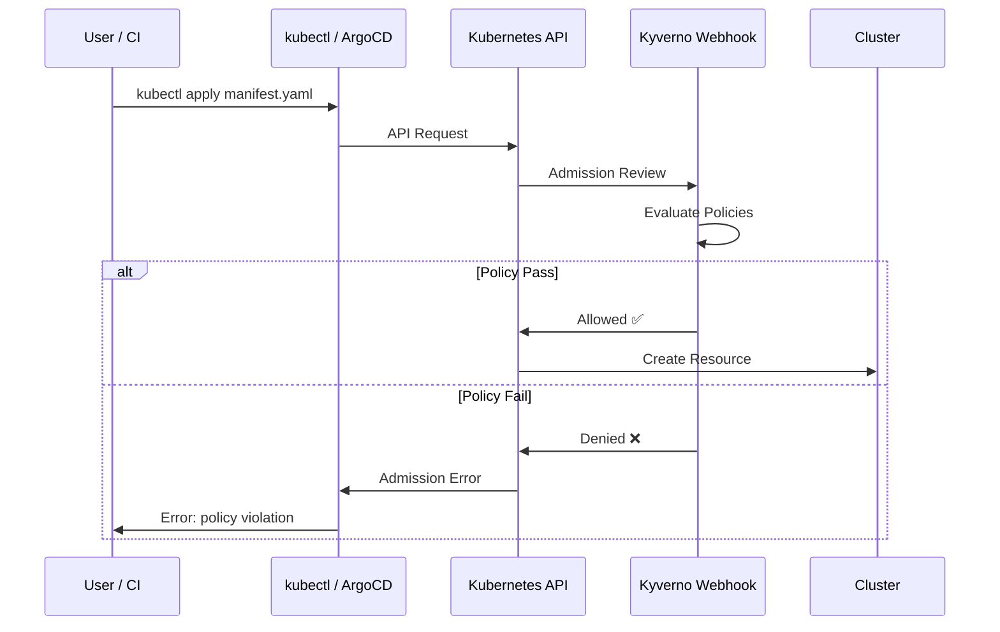

# Admission Control with Kyverno

Scanning manifests in CI is great — but what if someone applies a manifest directly with `kubectl apply`, bypassing the pipeline? **Admission control** closes that gap by enforcing security policies at the Kubernetes API level. Every workload must pass policy checks before it's allowed to run.

## How Admission Control Works



Kyverno sits between the API server and your cluster. **No manifest gets applied without passing its policies** — not from CI, not from ArgoCD, not from direct `kubectl` commands.

## What is Kyverno?

Kyverno is a Kubernetes-native policy engine. Unlike OPA/Gatekeeper which requires you to write Rego, Kyverno policies are written in YAML — the same format you already know from manifests.

It has three modes:
- **Enforce** — blocks non-compliant resources (hard stop)
- **Audit** — allows but logs violations (soft check)
- **Mutate** — automatically fixes resources to make them compliant

## Step 1: Install Kyverno

```bash
# Add the Kyverno Helm repo
helm repo add kyverno https://kyverno.github.io/kyverno/
helm repo update

# Install Kyverno
helm install kyverno kyverno/kyverno \
  --namespace kyverno \
  --create-namespace

# Wait for Kyverno to be ready
kubectl wait --for=condition=ready pod \
  -l app.kubernetes.io/component=admission-controller \
  -n kyverno \
  --timeout=120s

# Verify
kubectl get pods -n kyverno
```

## Step 2: Your First Policy — Require Non-Root Containers

This policy blocks any pod that tries to run as root:

```yaml
# policy-require-non-root.yaml
apiVersion: kyverno.io/v1
kind: ClusterPolicy
metadata:
  name: require-non-root
  annotations:
    policies.kyverno.io/title: Require Non-Root Containers
    policies.kyverno.io/description: >-
      Containers must not run as root. Enforces runAsNonRoot: true
      in the pod security context.
spec:
  validationFailureAction: Enforce   # Blocks non-compliant resources
  rules:
    - name: check-runAsNonRoot
      match:
        any:
          - resources:
              kinds:
                - Pod
      validate:
        message: "Containers must not run as root. Set runAsNonRoot: true in securityContext."
        pattern:
          spec:
            securityContext:
              runAsNonRoot: true
```

```bash
kubectl apply -f policy-require-non-root.yaml

# Test it — this pod should be DENIED
kubectl run test-root --image=nginx --overrides='
{
  "spec": {
    "securityContext": {"runAsNonRoot": false},
    "containers": [{"name": "nginx", "image": "nginx"}]
  }
}'
# Should output: Error from server: admission webhook denied the request
```

## Step 3: Require Resource Limits

```yaml
# policy-require-resources.yaml
apiVersion: kyverno.io/v1
kind: ClusterPolicy
metadata:
  name: require-resource-limits
  annotations:
    policies.kyverno.io/title: Require CPU and Memory Limits
    policies.kyverno.io/description: >-
      All containers must have CPU and memory limits set to prevent
      resource exhaustion attacks.
spec:
  validationFailureAction: Enforce
  rules:
    - name: check-resource-limits
      match:
        any:
          - resources:
              kinds:
                - Pod
      validate:
        message: "Containers must have CPU and memory limits. Add resources.limits to your container spec."
        pattern:
          spec:
            containers:
              - resources:
                  limits:
                    cpu: "?*"
                    memory: "?*"
```

## Step 4: Disallow Latest Image Tag

```yaml
# policy-disallow-latest.yaml
apiVersion: kyverno.io/v1
kind: ClusterPolicy
metadata:
  name: disallow-latest-tag
  annotations:
    policies.kyverno.io/title: Disallow Latest Tag
    policies.kyverno.io/description: >-
      The latest image tag is mutable and unpredictable.
      Use specific version tags for reproducible deployments.
spec:
  validationFailureAction: Enforce
  rules:
    - name: require-image-tag
      match:
        any:
          - resources:
              kinds:
                - Pod
      validate:
        message: "Image tag must be specified and must not be 'latest'. Use a specific version tag."
        pattern:
          spec:
            containers:
              - image: "!*:latest"
```

## Step 5: Disallow Privileged Containers

```yaml
# policy-disallow-privileged.yaml
apiVersion: kyverno.io/v1
kind: ClusterPolicy
metadata:
  name: disallow-privileged
  annotations:
    policies.kyverno.io/title: Disallow Privileged Containers
    policies.kyverno.io/description: >-
      Privileged containers have full access to the host.
      This is almost never required and is a critical security risk.
spec:
  validationFailureAction: Enforce
  rules:
    - name: check-privileged
      match:
        any:
          - resources:
              kinds:
                - Pod
      validate:
        message: "Privileged containers are not allowed."
        pattern:
          spec:
            containers:
              - =(securityContext):
                  =(privileged): false
```

## Step 6: Auto-Mutate — Add Default Security Context

Instead of blocking deployments, you can use a **mutate** policy to automatically add a safe security context if one isn't specified. This is useful during migration:

```yaml
# policy-mutate-security-context.yaml
apiVersion: kyverno.io/v1
kind: ClusterPolicy
metadata:
  name: add-default-security-context
spec:
  rules:
    - name: add-security-context
      match:
        any:
          - resources:
              kinds:
                - Pod
      mutate:
        patchStrategicMerge:
          spec:
            securityContext:
              +(runAsNonRoot): true
              +(runAsUser): 1000
              +(fsGroup): 1000
```

> **Note:** The `+()` syntax means "only add if not already set" — it won't override values you've explicitly configured.

## Step 7: Start in Audit Mode First

Before enforcing policies, run in **Audit** mode to see what would fail without breaking anything:

```yaml
spec:
  validationFailureAction: Audit   # Log violations, don't block
```

```bash
# Check audit violations
kubectl get policyreport -A
kubectl describe policyreport -A
```

Switch to `Enforce` once you've fixed all violations.

## Apply All Policies at Once

Organize your policies in a directory:

```bash
mkdir -p policies/kyverno

# Apply all policies
kubectl apply -f policies/kyverno/

# Check policy status
kubectl get clusterpolicy
```

## Verify Your App Still Deploys

After applying policies, verify ArgoCD can still sync your application:

```bash
# Sync ArgoCD app
argocd app sync three-tier-app-dev

# If sync fails, check the error
argocd app get three-tier-app-dev

# Check Kyverno policy reports
kubectl get policyreport -n three-tier-app-dev
kubectl describe policyreport -n three-tier-app-dev
```

If ArgoCD sync fails due to a policy violation, fix the Helm chart (add the required security context, resource limits, etc.) and push again.

## Common Kyverno Commands

```bash
# List all policies
kubectl get clusterpolicy

# Check policy status (should show READY)
kubectl get clusterpolicy -o wide

# View policy violations (audit mode)
kubectl get policyreport -A

# Describe a policy report
kubectl describe policyreport -n three-tier-app-dev

# Delete a policy
kubectl delete clusterpolicy require-latest-tag

# Check Kyverno logs
kubectl logs -n kyverno -l app.kubernetes.io/component=admission-controller
```

## Common Issues

### ArgoCD sync fails after installing Kyverno
```bash
# Check what policy is blocking
kubectl get policyreport -n three-tier-app-dev -o yaml
# Fix the violation in your Helm chart values, then re-sync
```

### Kyverno blocks system pods
```bash
# Exclude system namespaces from policies using match/exclude
spec:
  rules:
    - name: my-rule
      match:
        resources:
          kinds: [Pod]
      exclude:
        resources:
          namespaces:
            - kube-system
            - kyverno
            - argocd
```

### Policy in Enforce mode breaks existing workloads
```bash
# Switch to Audit first, fix violations, then switch back to Enforce
kubectl patch clusterpolicy require-non-root \
  --type=merge \
  -p '{"spec":{"validationFailureAction":"Audit"}}'
```

## Cheat Sheet

```bash
# Install Kyverno
helm install kyverno kyverno/kyverno -n kyverno --create-namespace

# Apply a policy
kubectl apply -f policy.yaml

# Check all policies
kubectl get clusterpolicy

# Check violations (audit mode)
kubectl get policyreport -A

# Test a policy manually
kubectl run test --image=nginx:latest  # Should be denied by disallow-latest policy

# View Kyverno webhook
kubectl get validatingwebhookconfigurations | grep kyverno
```

## Next Steps

Your cluster now enforces security policies at admission time. Even if someone bypasses your CI pipeline, non-compliant workloads can't run. The next step is protecting your build artifacts — making sure the images you deploy are exactly the ones you built. Move on to [Guide 15 — Supply Chain Security](15-supply-chain-security.md).
