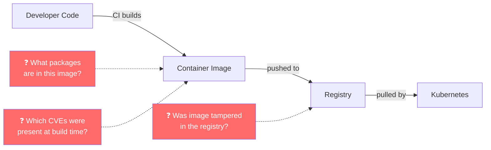
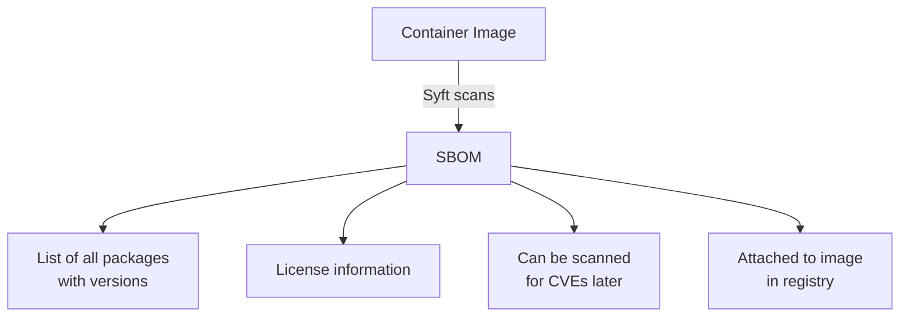
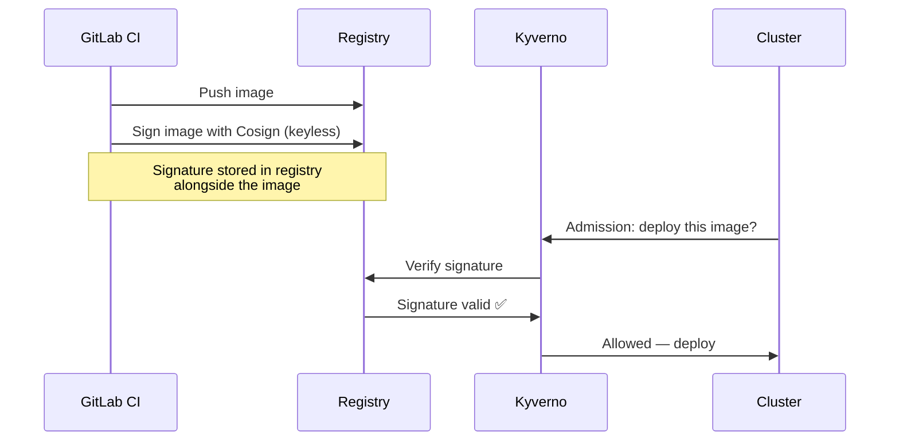

# Supply Chain Security: SBOM and Image Signing

How do you know the container image running in production is the exact same one your CI pipeline built? What if someone tampered with the image in the registry? **Supply chain security** answers these questions through SBOMs and cryptographic image signing.

## The Supply Chain Problem



Supply chain attacks target the pipeline itself — not your code, but the tools and artifacts that build and distribute it. Two controls address this:

- **SBOM** (Software Bill of Materials) — a manifest of every package inside your image
- **Image signing** — a cryptographic signature proving the image came from your CI pipeline and hasn't been modified

## Part 1: SBOM with Syft

### What is an SBOM?

An SBOM lists every software component in your container image — OS packages, Node.js packages, their versions, and their licenses. It answers "what's in this image?" at any point in time.



### Install Syft

```bash
# macOS
brew install syft

# Linux
curl -sSfL https://raw.githubusercontent.com/anchore/syft/main/install.sh | sh -s -- -b /usr/local/bin

# Verify
syft version
```

### Generate an SBOM Locally

```bash
# Generate SBOM for a local image
syft my-app/backend:latest

# Output in CycloneDX format (widely supported)
syft my-app/backend:latest -o cyclonedx-json > sbom-backend.json

# Output in SPDX format (Linux Foundation standard)
syft my-app/backend:latest -o spdx-json > sbom-backend.spdx.json

# Scan a directory instead of an image
syft dir:./app/backend
```

**Example output:**
```
NAME              VERSION    TYPE
express           4.18.2     npm
pg                8.11.3     npm
cors              2.8.5      npm
node              20.11.0    binary
alpine-baselayout 3.4.3      apk
musl              1.2.4      apk
```

### Add SBOM Generation to GitLab CI

```yaml
# In .gitlab-ci.yml — add after build stage

generate-sbom:
  stage: build
  image: anchore/syft:latest
  needs: [build-backend, build-frontend]
  script:
    # Generate SBOM for each image
    - syft $CI_REGISTRY_IMAGE/backend:$CI_COMMIT_SHA
        -o cyclonedx-json
        > sbom-backend.json
    - syft $CI_REGISTRY_IMAGE/frontend:$CI_COMMIT_SHA
        -o cyclonedx-json
        > sbom-frontend.json
    - echo "SBOM generated for backend and frontend"
  artifacts:
    when: always
    paths:
      - sbom-backend.json
      - sbom-frontend.json
    expire_in: 90 days
```

## Part 2: Image Signing with Cosign

### What is Image Signing?

Cosign attaches a cryptographic signature to your container image. Before deploying, Kyverno verifies this signature — if it doesn't match, the deployment is blocked.



### Install Cosign

```bash
# macOS
brew install cosign

# Linux
curl -O -L "https://github.com/sigstore/cosign/releases/latest/download/cosign-linux-amd64"
mv cosign-linux-amd64 /usr/local/bin/cosign
chmod +x /usr/local/bin/cosign

# Verify
cosign version
```

### Keyless Signing (Recommended)

Keyless signing uses your CI/CD identity (GitLab OIDC token) instead of a long-lived key. No key management required.

```bash
# Sign an image (keyless — uses OIDC token from CI)
COSIGN_EXPERIMENTAL=1 cosign sign $CI_REGISTRY_IMAGE/backend:$CI_COMMIT_SHA

# Verify the signature
COSIGN_EXPERIMENTAL=1 cosign verify \
  --certificate-identity-regexp ".*" \
  --certificate-oidc-issuer "https://gitlab.com" \
  $CI_REGISTRY_IMAGE/backend:$CI_COMMIT_SHA
```

### Add Image Signing to GitLab CI

```yaml
sign-images:
  stage: build
  image: bitnami/cosign:latest
  needs: [build-backend, build-frontend, generate-sbom]
  variables:
    COSIGN_EXPERIMENTAL: "1"
  id_tokens:
    SIGSTORE_ID_TOKEN:
      aud: sigstore
  script:
    # Sign images with keyless signing
    - cosign sign --yes $CI_REGISTRY_IMAGE/backend:$CI_COMMIT_SHA
    - cosign sign --yes $CI_REGISTRY_IMAGE/frontend:$CI_COMMIT_SHA

    # Attach SBOM to the image in the registry
    - cosign attach sbom
        --sbom sbom-backend.json
        --type cyclonedx
        $CI_REGISTRY_IMAGE/backend:$CI_COMMIT_SHA
    - cosign attach sbom
        --sbom sbom-frontend.json
        --type cyclonedx
        $CI_REGISTRY_IMAGE/frontend:$CI_COMMIT_SHA

    - echo "Images signed and SBOMs attached"
```

### Enforce Signed Images with Kyverno

Now add a Kyverno policy that blocks any unsigned image from running in your cluster:

```yaml
# policy-verify-image-signature.yaml
apiVersion: kyverno.io/v1
kind: ClusterPolicy
metadata:
  name: verify-image-signatures
  annotations:
    policies.kyverno.io/title: Verify Image Signatures
    policies.kyverno.io/description: >-
      All container images must be signed by the CI pipeline using Cosign.
      Unsigned images are not allowed to run.
spec:
  validationFailureAction: Enforce
  rules:
    - name: verify-backend-image
      match:
        any:
          - resources:
              kinds:
                - Pod
              namespaces:
                - three-tier-app-dev
                - three-tier-app-prod
      verifyImages:
        - imageReferences:
            - "registry.gitlab.com/YOUR_PROJECT/backend:*"
          attestors:
            - count: 1
              entries:
                - keyless:
                    subject: "https://gitlab.com/YOUR_PROJECT//.gitlab-ci.yml@refs/heads/*"
                    issuer: "https://gitlab.com"
```

> **Replace** `YOUR_PROJECT` with your actual GitLab project path.

## Verify the Full Chain

```bash
# 1. Verify image signature
COSIGN_EXPERIMENTAL=1 cosign verify \
  --certificate-identity-regexp ".*gitlab.com.*" \
  --certificate-oidc-issuer "https://gitlab.com" \
  $CI_REGISTRY_IMAGE/backend:$CI_COMMIT_SHA

# 2. View attached SBOM
cosign download sbom $CI_REGISTRY_IMAGE/backend:$CI_COMMIT_SHA

# 3. Scan the attached SBOM for vulnerabilities
cosign download sbom $CI_REGISTRY_IMAGE/backend:$CI_COMMIT_SHA \
  | trivy sbom -

# 4. Check Kyverno policy report for signature violations
kubectl get policyreport -n three-tier-app-dev
```

## What Happens When You Try to Deploy an Unsigned Image

```bash
# Try to deploy an unsigned image
kubectl run unsigned-test \
  --image=nginx:latest \
  -n three-tier-app-dev

# Kyverno output:
# Error from server: admission webhook "mutate.kyverno.svc.cluster.local" denied the request:
# image signature verification failed: no signatures found for image nginx:latest
```

## Common Issues

### Cosign can't authenticate with registry
```bash
# Login to registry first
cosign login registry.gitlab.com -u $CI_REGISTRY_USER -p $CI_REGISTRY_PASSWORD
```

### Kyverno policy rejects valid image
```bash
# Check what subject Cosign used during signing
COSIGN_EXPERIMENTAL=1 cosign verify \
  --certificate-identity-regexp ".*" \
  --certificate-oidc-issuer "https://gitlab.com" \
  $IMAGE | jq '.[0].optional.Subject'

# Update your Kyverno policy's subject to match
```

### SBOM generation fails on private image
```bash
# Make sure Syft is authenticated
syft registry.gitlab.com/my-project/backend:latest \
  --credentials-file ~/.docker/config.json
```

## Cheat Sheet

```bash
# Generate SBOM
syft IMAGE -o cyclonedx-json > sbom.json

# Sign image (keyless)
COSIGN_EXPERIMENTAL=1 cosign sign IMAGE

# Verify signature
COSIGN_EXPERIMENTAL=1 cosign verify \
  --certificate-identity-regexp ".*" \
  --certificate-oidc-issuer "https://gitlab.com" \
  IMAGE

# Attach SBOM to image
cosign attach sbom --sbom sbom.json --type cyclonedx IMAGE

# Download and scan SBOM
cosign download sbom IMAGE | trivy sbom -
```

## Next Steps

Your images are now signed, and your cluster only runs images it can verify. The last layer of defense is what happens after your workloads are running — detecting threats in real time. Move on to [Guide 16 — Runtime Security with Falco](16-runtime-security.md).
