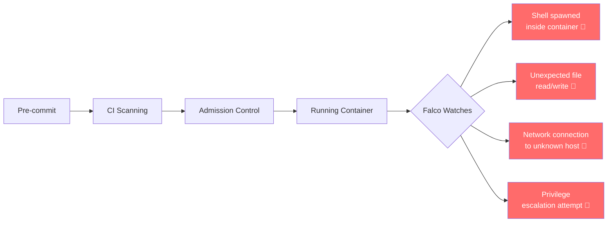

# Runtime Security with Falco

All the security controls so far run before or at deploy time — scanning, signing, policy enforcement. But what happens after your app is running? **Falco** watches your containers in real time and alerts you when something suspicious happens inside them.

## Why Runtime Security Matters



Even a perfectly scanned, signed, policy-compliant container can be exploited at runtime if there's a zero-day vulnerability or a logic flaw in your application. Falco detects this by monitoring system calls at the kernel level.

## What is Falco?

Falco is a Cloud Native Security tool from CNCF that monitors the kernel for suspicious activity. It detects things like:

- A shell (`bash`, `sh`) being spawned inside a container
- A container reading sensitive files (`/etc/passwd`, `/etc/shadow`)
- Unexpected network connections
- A process writing to a binary directory
- Privilege escalation (setuid execution)
- Cryptominer-like behavior (high CPU + network activity)

When it detects something, it sends an alert to your observability stack (Grafana/Loki) so you can investigate.

## Step 1: Install Falco

```bash
# Add the Falco Helm repo
helm repo add falcosecurity https://falcosecurity.github.io/charts
helm repo update

# Install Falco with eBPF probe (works on most modern kernels)
helm install falco falcosecurity/falco \
  --namespace falco \
  --create-namespace \
  --set driver.kind=ebpf \
  --set falcosidekick.enabled=true \
  --set falcosidekick.webui.enabled=true

# Wait for Falco to be ready
kubectl wait --for=condition=ready pod \
  -l app.kubernetes.io/name=falco \
  -n falco \
  --timeout=180s

# Verify
kubectl get pods -n falco
```

> **Note:** Falco needs access to the host kernel. If you're using kind, you may need the `--set driver.kind=modern_ebpf` option instead.

## Step 2: Understand Falco Rules

Falco comes with a large set of default rules. Each rule looks like this:

```yaml
- rule: Terminal shell in container
  desc: >
    A shell was used as the entrypoint/exec point into a container
    with an attached terminal. Warning: not every container with a
    terminal is necessarily bad. Use with caution.
  condition: >
    spawned_process
    and container
    and shell_procs
    and proc.tty != 0
    and container_entrypoint
  output: >
    A shell was spawned in a container with an attached terminal
    (user=%user.name user_loginuid=%user.loginuid
    %container.info shell=%proc.name parent=%proc.pname
    cmdline=%proc.cmdline pid=%proc.pid terminal=%proc.tty
    container_id=%container.id image=%container.image.repository)
  priority: NOTICE
  tags: [container, shell, mitre_execution]
```

Rules have:
- **condition** — the event pattern that triggers the rule
- **output** — what gets logged when triggered
- **priority** — DEBUG, INFORMATIONAL, NOTICE, WARNING, ERROR, CRITICAL, ALERT, EMERGENCY

## Step 3: Test Falco Is Working

```bash
# Trigger a Falco alert by running a shell inside a container
kubectl exec -it \
  $(kubectl get pod -l app=backend -n three-tier-app-dev -o name | head -1) \
  -n three-tier-app-dev \
  -- sh

# In another terminal, check Falco logs
kubectl logs -n falco -l app.kubernetes.io/name=falco --tail=20

# You should see something like:
# 09:15:23.456 Warning Detected a shell spawned in a container
# (user=root container=backend image=registry.gitlab.com/...)
```

## Step 4: Write a Custom Rule for Your App

Add rules specific to your task manager application. For example, your backend should never read `/etc/shadow` or spawn a shell:

```yaml
# custom-rules.yaml
- rule: Backend container spawns shell
  desc: The backend container spawned an unexpected shell process
  condition: >
    spawned_process
    and container
    and container.image.repository contains "backend"
    and shell_procs
  output: >
    Shell spawned in backend container — possible intrusion
    (user=%user.name container=%container.name
    image=%container.image.repository cmd=%proc.cmdline)
  priority: CRITICAL
  tags: [custom, backend, intrusion]

- rule: Backend reads sensitive files
  desc: Backend container attempted to read sensitive system files
  condition: >
    open_read
    and container
    and container.image.repository contains "backend"
    and fd.name in (/etc/shadow, /etc/passwd, /root/.ssh/id_rsa)
  output: >
    Sensitive file read attempt in backend container
    (user=%user.name file=%fd.name container=%container.name)
  priority: CRITICAL
  tags: [custom, backend, data-exfiltration]

- rule: Unexpected outbound connection from backend
  desc: Backend container made an unexpected outbound network connection
  condition: >
    outbound
    and container
    and container.image.repository contains "backend"
    and not fd.sip.name in (postgres, "127.0.0.1")
    and not fd.sport in (5432, 3000)
  output: >
    Unexpected outbound connection from backend
    (container=%container.name dest=%fd.rip:%fd.rport
    proto=%fd.l4proto image=%container.image.repository)
  priority: WARNING
  tags: [custom, backend, network]
```

```bash
# Apply custom rules via Helm
helm upgrade falco falcosecurity/falco \
  --namespace falco \
  --set-file customRules.custom-rules\.yaml=custom-rules.yaml
```

## Step 5: Send Falco Alerts to Grafana

Falco ships with **Falcosidekick** — a fan-out component that forwards alerts to Slack, PagerDuty, Loki, and more. Since you already have Loki from Phase 1, let's forward Falco alerts there:

```bash
# Upgrade Falco with Loki integration
helm upgrade falco falcosecurity/falco \
  --namespace falco \
  --set falcosidekick.enabled=true \
  --set falcosidekick.config.loki.hostport="http://loki.monitoring.svc.cluster.local:3100" \
  --set falcosidekick.config.loki.minimumpriority=warning
```

Now Falco WARNING and above alerts appear in your Grafana Loki log explorer:

```logql
# In Grafana → Explore → Loki
{app="falco"} | json | priority="CRITICAL" or priority="WARNING"
```

## Step 6: Create a Grafana Dashboard for Security Alerts

In Grafana, create a new dashboard with these panels:

**Panel 1: Critical Security Events (last 24h)**
```logql
count_over_time({app="falco"} | json | priority="CRITICAL" [24h])
```

**Panel 2: Security Event Stream (live)**
```logql
{app="falco"} | json | line_format "{{.priority}} | {{.rule}} | {{.output}}"
```

**Panel 3: Top Rules Triggered (bar chart)**
```logql
topk(10, count by (rule) ({app="falco"} | json [1h]))
```

## Step 7: Set Up Alerting for Critical Events

In Grafana Alerting, create an alert that fires when Falco logs a CRITICAL event:

1. Go to **Alerting → Alert Rules → New Alert Rule**
2. Set data source: **Loki**
3. Query:
   ```logql
   count_over_time({app="falco"} | json | priority="CRITICAL" [5m])
   ```
4. Condition: **IS ABOVE 0**
5. Evaluation: every 1 minute
6. Add notification channel (Slack, email, or PagerDuty from Phase 1)

## Falco Priority Levels

| Priority | What It Means | Action |
|---|---|---|
| DEBUG / INFORMATIONAL | Normal activity logged for audit | No action needed |
| NOTICE | Slightly unusual but not necessarily malicious | Monitor |
| WARNING | Suspicious activity — investigate | Investigate promptly |
| ERROR | Likely security incident | Respond now |
| CRITICAL / ALERT | Active attack or intrusion | Incident response |

## Common Issues

### Falco pods not starting (eBPF probe fails)
```bash
# Try modern_ebpf driver
helm upgrade falco falcosecurity/falco \
  --namespace falco \
  --set driver.kind=modern_ebpf

# Or use the legacy kernel module (requires kernel headers)
helm upgrade falco falcosecurity/falco \
  --namespace falco \
  --set driver.kind=module
```

### Too many noisy alerts
```bash
# Temporarily disable a noisy built-in rule
helm upgrade falco falcosecurity/falco \
  --namespace falco \
  --set-string customRules.disable-noise\.yaml="- rule: Terminal shell in container\n  enabled: false"
```

### Alerts not appearing in Loki
```bash
# Check Falcosidekick logs
kubectl logs -n falco -l app.kubernetes.io/name=falcosidekick

# Verify Loki URL is reachable from falco namespace
kubectl exec -n falco deploy/falco-falcosidekick -- \
  wget -q -O- http://loki.monitoring.svc.cluster.local:3100/ready
```

## Cheat Sheet

```bash
# Check Falco is running
kubectl get pods -n falco

# Live tail Falco alerts
kubectl logs -n falco -l app.kubernetes.io/name=falco -f

# Trigger a test alert (run shell in container)
kubectl exec -it <backend-pod> -n three-tier-app-dev -- sh

# List default Falco rules
kubectl exec -n falco deploy/falco -- falco --list

# Reload Falco rules after change
kubectl rollout restart daemonset/falco -n falco

# Access Falcosidekick UI
kubectl port-forward -n falco svc/falco-falcosidekick-ui 2802:2802
# Open http://localhost:2802
```

## Congratulations

You've completed the Phase 2 DevSecOps implementation. Your pipeline now has:

✅ **SAST, SCA & Secrets scanning** — vulnerabilities caught before merge  
✅ **Secrets management** — no credentials in Git or manifests  
✅ **Manifest security** — Helm and K8s configs scanned for misconfigs  
✅ **Admission control** — policy enforcement at the cluster level  
✅ **Supply chain security** — SBOM generated, images signed and verified  
✅ **Runtime security** — Falco monitoring for threats in running containers  

Review the [DevSecOps Capstone Requirements](devsecops-capstone-requirements.md) for your final deliverables and evaluation criteria.
