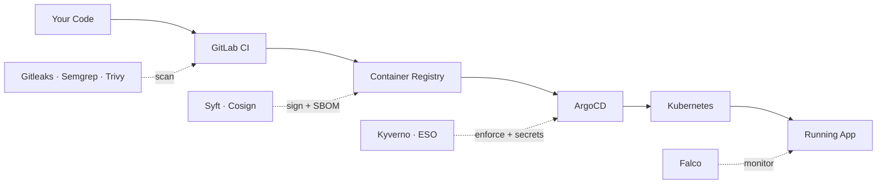
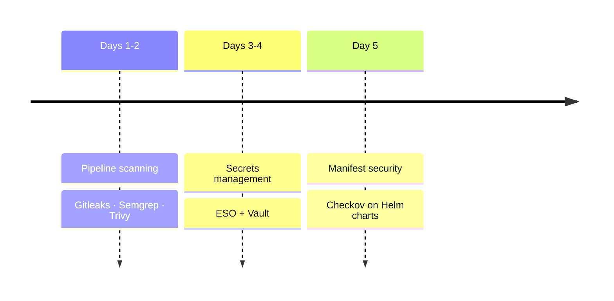
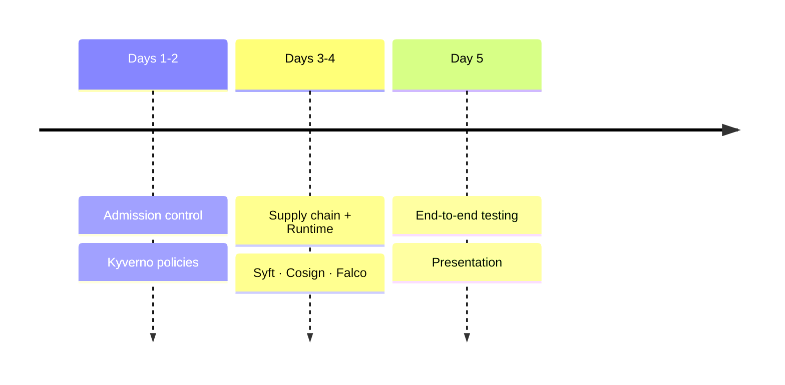

# DevSecOps Implementation Guide — Phase 2

Welcome to Phase 2! This guide will walk you through securing the pipeline and cluster you built in Phase 1. Security is not a separate step — it runs at every stage.

> **Prerequisite:** Your Phase 1 implementation (Kubernetes, Helm, GitLab CI, ArgoCD, Observability) must be working before starting here.

## The Big Picture

In Phase 1 you built this:

In Phase 2 you will secure every stage of it:

## What You'll Implement

| # | Control | Tools |
|---|---|---|
| 1 | Pipeline Security | Gitleaks, Semgrep, Trivy |
| 2 | Secrets Management | External Secrets Operator, HashiCorp Vault |
| 3 | Manifest Security | Checkov |
| 4 | Admission Control | Kyverno |
| 5 | Supply Chain Security | Syft, Cosign |
| 6 | Runtime Security | Falco |

## Two-Week Timeline

### Week 1: Pipeline & Cluster Security

### Week 2: Advanced Controls & Runtime

## Step-by-Step Guides

1. [DevSecOps Introduction](./10-devsecops-intro.md)
   - Shift-left security, P0/P1 controls
   - How Phase 2 builds on Phase 1
   - The security mindset

2. [SAST, SCA & Secrets Scanning](./11-sast-sca-scanning.md)
   - Gitleaks — secrets detection in every push
   - Semgrep — static code analysis (OWASP Top 10)
   - Trivy — dependency and image scanning
   - Adding all three to GitLab CI

3. [Secrets Management](./12-secrets-management.md)
   - Installing External Secrets Operator
   - Setting up HashiCorp Vault (local dev)
   - Migrating database credentials out of Git
   - SecretStore and ExternalSecret CRDs

4. [Manifest Security](./13-manifest-security.md)
   - Scanning Helm charts with Checkov
   - Fixing common misconfigurations (non-root, resource limits, no latest tag)
   - Adding Checkov to the CI pipeline

5. [Admission Control](./14-admission-control.md)
   - Installing Kyverno
   - Core policies: non-root, resource limits, no latest tag, signed images
   - Audit mode vs Enforce mode
   - Verifying ArgoCD still syncs

6. [Supply Chain Security](./15-supply-chain-security.md)
   - Generating SBOMs with Syft (CycloneDX format)
   - Signing images with Cosign (keyless)
   - Attaching SBOMs to images in the registry
   - Kyverno policy to verify signatures at admission

7. [Runtime Security](./16-runtime-security.md)
   - Installing Falco with eBPF probe
   - Writing custom rules for your application
   - Forwarding alerts to Loki
   - Building a Grafana security dashboard

## Deliverables

See [DevSecOps Capstone Requirements](./devsecops-capstone-requirements.md) for the full breakdown of deliverables, evaluation criteria, and timeline.

## Getting Help

If you get stuck:
1. Re-read the relevant guide — most issues are covered in the troubleshooting section
2. Check `kubectl describe` and pod logs for errors
3. Ask during lab sessions

## Remember

- Phase 1 must be working before starting Phase 2
- Implement in order — each guide builds on the previous one
- Start policies in Audit mode before switching to Enforce
- A failed scan is a success — you caught something before production
- Test each control before moving to the next
