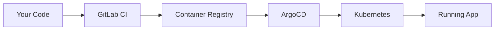
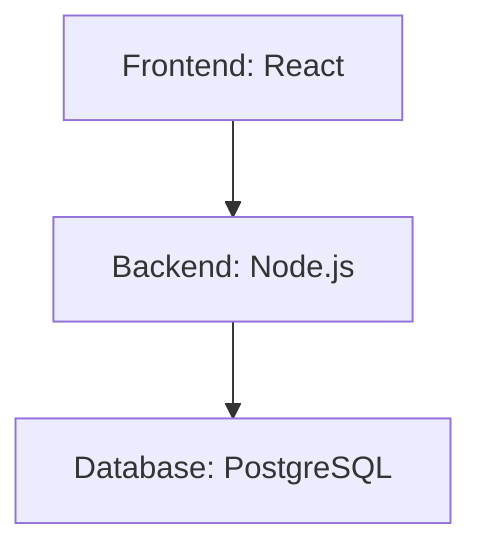
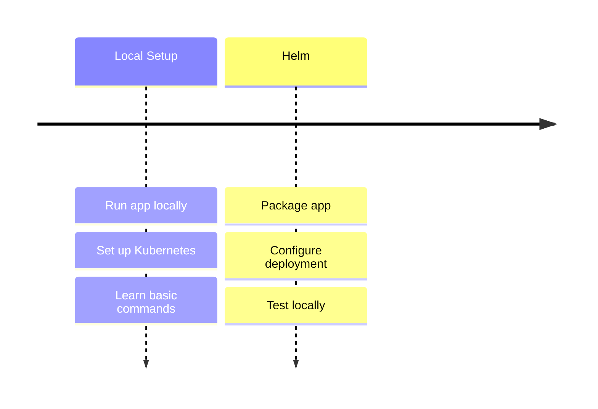
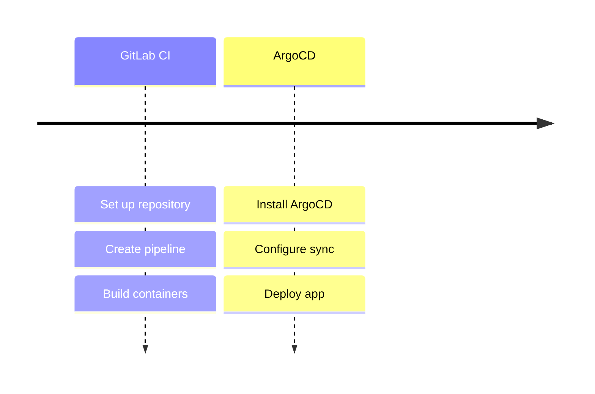
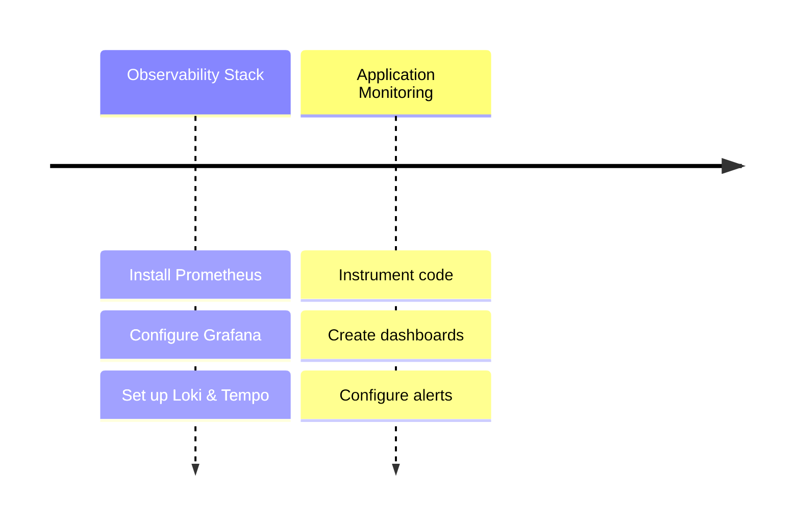

# DevOps Implementation Guide

Welcome! This guide will walk you through implementing DevOps practices for a simple task management application. Don't worry if some concepts are new - we'll explain everything step by step.

## The Big Picture

Before diving into the technical details, let's understand what we're building:



1. You'll write code and push to GitLab
2. GitLab CI automatically builds container images
3. ArgoCD watches for changes and updates Kubernetes
4. Your app runs in Kubernetes

This is called a "GitOps" workflow - everything starts with a git push!

## Starting Point: The Sample App

We'll use a simple task management application (provided in the `/app` directory) to learn DevOps practices. It has three parts:



First, let's make sure you can run it locally:
   ```bash
   cd app
   docker compose up
   ```

2. Test that it works:
   - Frontend: http://localhost:3000 (React dev server)
   - Backend API: http://localhost:3001
   - Try the features:
     * Create a task
     * Update its status
     * Delete the task

## Your Learning Journey

We'll implement DevOps practices in small, manageable steps:

### Week 1: Building the Foundation


### Week 2: Automation & GitOps


### Week 3-4: Observability & Monitoring


You'll learn to:

1. **Local Kubernetes Setup**
   - Choose a local Kubernetes solution
   - Set up your cluster
   - Learn basic Kubernetes concepts

2. **Helm Chart Creation**
   - Package the application
   - Configure deployments
   - Manage different environments

3. **CI/CD Pipeline**
   - Set up GitLab CI
   - Build containers
   - Automate deployments

4. **GitOps with ArgoCD**
   - Install ArgoCD
   - Configure applications
   - Implement GitOps workflow

5. **Observability Stack**
   - Deploy Prometheus, Grafana, Loki, Tempo
   - Create monitoring dashboards
   - Set up alerting and instrumentation

## Step-by-Step Guides

1. [Local Development Setup](./01-local-setup.md)
   - Setting up your Kubernetes cluster
   - Basic concepts and commands
   - First deployment

2. [Helm Chart Creation](./02-helm-charts.md)
   - Creating your first chart
   - Converting our app
   - Testing deployments

3. [GitLab CI Setup](./03-gitlab-ci.md)
   - Pipeline configuration
   - Building images
   - Automated deployment

4. [ArgoCD Setup](./04-argocd-setup.md)
   - Installing ArgoCD
   - Application setup
   - GitOps workflow

5. [Deployment Guide](./05-deployment.md)
   - Putting it all together
   - Testing everything
   - Troubleshooting

6. [Observability Setup](./06-observability-setup.md)
   - Installing the PGLT stack
   - Basic configuration
   - Testing monitoring

7. [Grafana Dashboards](./07-grafana-dashboards.md)
   - Creating effective dashboards
   - Essential panels and metrics
   - Best practices

8. [Alerting Setup](./08-alerting-setup.md)
   - Configuring alerts
   - Notification channels
   - Alert best practices

9. [Application Instrumentation](./09-app-instrumentation.md)
   - Adding metrics to your code
   - Structured logging
   - Performance monitoring

## Phase 2: DevSecOps Guides

If you are on the `devsecops` branch, continue with:

10. [DevSecOps Introduction](./10-devsecops-intro.md)
    - Shift-left security, P0/P1 controls, how Phase 2 builds on Phase 1

11. [SAST, SCA & Secrets Scanning](./11-sast-sca-scanning.md)
    - Gitleaks, Semgrep, Trivy in GitLab CI

12. [Secrets Management](./12-secrets-management.md)
    - External Secrets Operator and HashiCorp Vault

13. [Manifest Security](./13-manifest-security.md)
    - Checkov scanning for Helm charts and K8s manifests

14. [Admission Control](./14-admission-control.md)
    - Kyverno policies and enforcement

15. [Supply Chain Security](./15-supply-chain-security.md)
    - Syft SBOM generation and Cosign image signing

16. [Runtime Security](./16-runtime-security.md)
    - Falco threat detection with Grafana alerting

See [DevSecOps Capstone Requirements](./devsecops-capstone-requirements.md) for Phase 2 deliverables and evaluation.

---

## Getting Help

If you get stuck:
1. Check the app's documentation
2. Review error messages
3. Ask during lab sessions

## Timeline

### Week 1: Foundation
- Days 1-2: Local Kubernetes
- Days 3-4: Helm Charts
- Day 5: Review and fixes

### Week 2: Implementation
- Days 1-2: GitLab CI
- Days 3-4: ArgoCD
- Day 5: Final testing

### Week 3: Observability
- Days 1-2: Install monitoring stack
- Days 3-4: Create dashboards and alerts
- Day 5: Application instrumentation

### Week 4: Advanced Monitoring
- Days 1-2: Advanced dashboards
- Days 3-4: Performance optimization
- Day 5: Documentation and presentation

Remember:
- Take it step by step
- Test each part
- Ask questions when needed
- Keep it simple!
